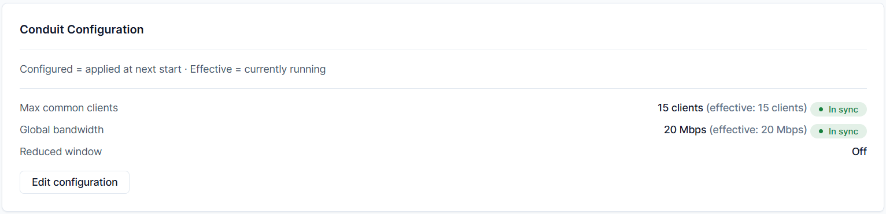
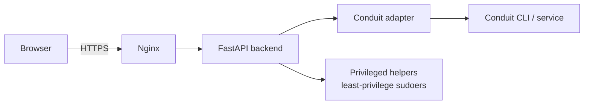

# Conduit Control Center

[](https://github.com/kiavash599/conduit-control-center/actions)
[](LICENSE)
[](https://www.python.org/)
[](docs/architecture.md)

**Conduit Control Center (CCC)** is a lightweight, open-source web dashboard that turns a Raspberry Pi into a managed [Psiphon Conduit](https://conduit.psiphon.ca) node — helping people in censored regions reach the open internet. Install it once, then run, monitor, configure, and back up your node from any browser. No command line required.

CCC is **aggregate-only by design**: it never sees or stores who uses your node, their identity, their IP, or their traffic.

<p align="center">
  <a href="docs/user-guide/07-first-login-and-dashboard-tour.md">
    
  </a>
</p>

> **New here?** → [What is this?](#what-is-this) · [Install](#quick-install) · [Privacy](#privacy) · [Documentation](#documentation)

---

## What is this?

[Psiphon Conduit](https://conduit.psiphon.ca) lets volunteers donate a slice of their home internet so that people living under censorship can get online. Running a Conduit node normally means working on the Linux command line.

**Conduit Control Center replaces that with a clean web dashboard.** You install it once on a Raspberry Pi, then everything — starting your node, watching its health, adjusting limits, backing it up — happens in your browser.

**Who is it for?** Ordinary people who want to help, not only system administrators. If you can flash an SD card and follow a checklist, you can run a node.

---

## Mission

Internet censorship is a daily reality in many countries, cutting people off from news, communication, and the open web. Psiphon Conduit exists so that volunteers anywhere can contribute connectivity and help close that gap.

But contributing has been harder than it should be — it has assumed comfort with Linux and the terminal. **CCC exists to remove that barrier.** It makes operating a Conduit node significantly easier, so that running one is realistic for everyday users, not just experienced administrators. The more people who can comfortably run a node, the more resilient the network becomes for those who depend on it.

---

## Privacy

Helping people behind censorship only works if their privacy is protected. CCC is built so that operating a node never exposes the people using it. Specifically, CCC provides:

- **Aggregate-only metrics** — totals such as bytes transferred, never anything per-person.
- **No per-user statistics.**
- **No user identity tracking.**
- **No visibility into any user's IP address.**
- **No inspection of user traffic** of any kind.
- **No user activity history.**

CCC also never stores your own secrets in plain sight: passphrases, API tokens, pairing links, and private keys are never logged, committed, or placed in URLs. See [SECURITY.md](SECURITY.md) and [docs/architecture.md](docs/architecture.md) for details.

---

## Features

| Feature | Description | Status | Default |
|---|---|---|---|
| **Dashboard** | One-click start / stop / restart, live status badge, system health (CPU, RAM, temperature, disk), log viewer, and light / dark / system themes | Shipped | On |
| **Contribution Advisor** | A read-only, aggregate guidance card that helps you understand how well your node is contributing | Shipped | On |
| **Traffic Collector** | A persistent, aggregate-only byte ledger with history and configurable retention | Optional | Off |
| **Conduit Configuration** | Adjust bandwidth, maximum clients, and a reduced-bandwidth time window — read and write | Shipped | On |
| **Personal Mode** | Create a personal Conduit identity for trusted contacts, with a pairing token and shareable QR code | Optional | Off |
| **Ryve QR Claim** | Claim your station in the Ryve mobile app by scanning a QR code; the private key is never exposed | Optional | Off |
| **Backup / Restore** | Create an encrypted backup of your CCC state and restore it through a guided flow | Shipped | On |
| **DDNS** | Automatically keeps your Cloudflare DNS record pointed at your changing public IP | Shipped | On |
| **Secure access** | Password login with account lockout, full HTTPS, CSRF protection, secrets never stored | Shipped | On |

> "Optional / Off" features ship disabled until you turn them on — nothing aggregate-or-personal is collected or enabled without your action.

---

## Screenshots

| Screen | What it shows |
|--------|---------------|
| [](docs/user-guide/08-contribution-advisor.md) | The **Contribution Advisor** — aggregate guidance with a severity level. |
| [](docs/user-guide/09-conduit-configuration.md) | **Conduit Configuration** — Configured vs Effective values with an in-sync indicator. |
| [](docs/user-guide/12-backup-and-restore.md) | **Backup & Restore** — inspect a backup before restoring; nothing changes until you confirm. |

The full dashboard is shown above; see [Chapter 7 — First Login & Dashboard Tour](docs/user-guide/07-first-login-and-dashboard-tour.md) for the complete tour. Screenshots live under [`docs/screenshots/`](docs/screenshots/); real domains, IPs, tokens, and QR codes are redacted or replaced with safe example values.

---

## Requirements

### Hardware

**Validated platforms** — CCC v0.3.1 installed, configured, and operated successfully:

- Raspberry Pi 3 Model B (1 GB RAM)
- Raspberry Pi 4 (2 GB RAM)

**Recommended:** Raspberry Pi 4 (4 GB RAM)

- Ubuntu 22.04 LTS ARM64
- A stable internet connection with a public IP address

### Cloudflare (recommended deployment)

This project is designed to run behind the Cloudflare proxy. Before installing, you need:

- A domain managed by Cloudflare (e.g. `example.com`)
- A DNS A record for your dashboard hostname (e.g. `conduit.example.com`) with **Proxy enabled** (orange cloud ON)
- Cloudflare SSL/TLS mode set to **Full (strict)**
- A Cloudflare Origin Certificate (created in the Cloudflare dashboard)
- A Cloudflare API token with `Zone:DNS:Edit` and `Zone:Zone:Read` permissions

> **New to Cloudflare?** Read [docs/pre-install.md](docs/pre-install.md) first — it walks you through every step in the Cloudflare dashboard before you run the installer. The whole process takes about 10 minutes.

### Alternative: direct IP (Let's Encrypt)

If you are not using the Cloudflare proxy, Let's Encrypt is supported. See [docs/tls-setup.md](docs/tls-setup.md).

> Self-signed certificates are **not supported** for public deployments.

---

## Quick Install

```bash
# 1. Complete the Cloudflare pre-install checklist (~10 minutes)
#    Read: docs/pre-install.md

# 2. Clone the repository
git clone https://github.com/kiavash599/conduit-control-center.git
cd conduit-control-center

# 3. Run the installer
chmod +x install.sh
sudo ./install.sh
```

The installer will:

1. Verify your OS and architecture
2. Prompt for your Cloudflare API token, zone name, and hostname
3. **Validate all inputs via the Cloudflare API** before making any system changes
4. Prompt for your Origin Certificate and private key file paths
5. Set up Nginx, systemd, the UFW firewall, and the DDNS cron job automatically
6. Print your dashboard URL when complete

> If any validation step fails, the installer exits cleanly with a plain-English explanation. No system changes are made until all inputs are verified.

### First login

Open the dashboard URL printed by the installer, sign in with the admin password you set during installation, and change it from **Settings** if you'd like. You're ready to start your node.

---

## Updating & Uninstalling

```bash
sudo ./update.sh      # pull and apply the latest version
sudo ./uninstall.sh   # cleanly remove CCC from the system
```

---

## Architecture

CCC is a small FastAPI backend behind Nginx, talking to Conduit through a thin adapter. Privileged actions go through narrowly-scoped helpers rather than giving the app broad system access.



Two principles run throughout:

- **Aggregate-only / privacy-preserving** — no per-user data is ever collected or stored (see [Privacy](#privacy)).
- **Least privilege** — helpers run with the minimum rights they need (scoped `sudoers`, exact command paths), TLS keys and secrets are tightly permissioned and never committed.

Full details: [docs/architecture.md](docs/architecture.md).

---

## Documentation

📖 **Read the docs online:** **https://kiavash599.github.io/conduit-control-center/**

- **English guide:** https://kiavash599.github.io/conduit-control-center/user-guide/01-introduction/
- **راهنمای فارسی:** https://kiavash599.github.io/conduit-control-center/fa/user-guide/01-introduction/

The published website is built from the Markdown in [`docs/`](docs/), which remains the canonical source of truth.

### User Guide

The complete CCC user guide is a 17-chapter walkthrough covering hardware, networking, installation, the dashboard, and day-to-day operation. It is published in two editions:

- **[English User Guide (Source of Truth)](docs/user-guide/README.md)** — 17 chapters. The official, authoritative documentation for CCC.
- **[راهنمای کاربری فارسی — Persian User Guide (Translation)](docs/fa/user-guide/README.md)** — 17 chapters. A translated edition of the English guide. If any discrepancy exists between the two, the English documentation takes precedence.

### Reference

| Document | Description |
|----------|-------------|
| [docs/pre-install.md](docs/pre-install.md) | **Start here** — Cloudflare dashboard setup before running the installer |
| [docs/tls-setup.md](docs/tls-setup.md) | TLS certificate configuration (Cloudflare Origin Cert and Let's Encrypt) |
| [docs/dev-setup.md](docs/dev-setup.md) | Local development environment setup |
| [docs/architecture.md](docs/architecture.md) | System architecture overview |
| API reference | Interactive OpenAPI docs from your running instance at `/api/docs` (Swagger UI), `/api/redoc` (ReDoc), and `/api/openapi.json` (raw schema) |

---

## Roadmap

CCC is actively maintained. Near-term directions:

- Continued documentation refinements across the English and Persian guides
- Further analytics and Advisor refinements
- User-interface polish
- Smoother installation and deployment

We deliberately avoid promising large speculative features. Substantial new directions are discussed openly in [Discussions](https://github.com/kiavash599/conduit-control-center/discussions) first.

---

## Contributing

Contributions are welcome. Please read [CONTRIBUTING.md](CONTRIBUTING.md) before opening a pull request.

This project is designed to be approachable for developers who are learning Linux, Python, and open-source workflows. If you get stuck, open a [Discussion](https://github.com/kiavash599/conduit-control-center/discussions) — there are no stupid questions.

---

## Security

Do not open a public issue for security vulnerabilities. See [SECURITY.md](SECURITY.md) for the responsible disclosure process.

---

## Licence

[MIT](LICENSE) — Copyright © 2026 Kiavash
