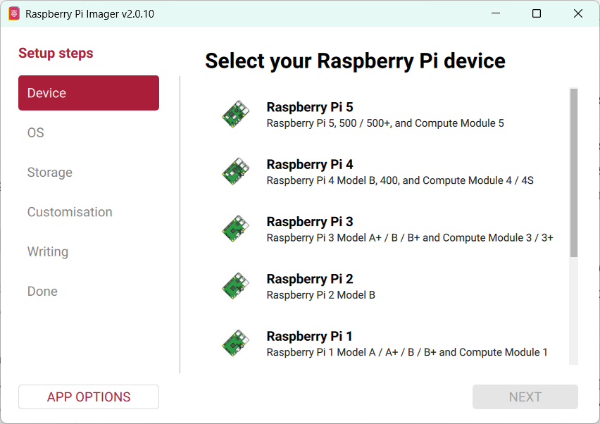
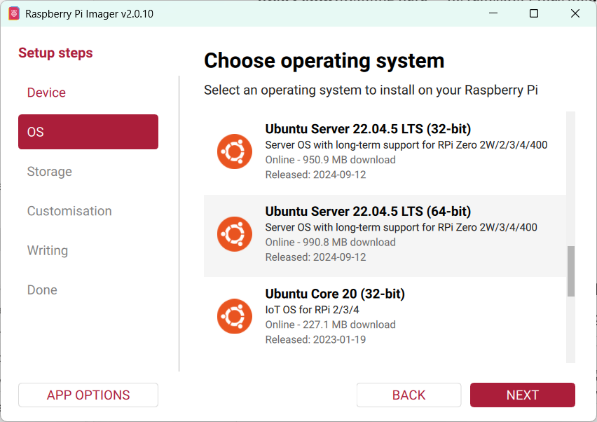
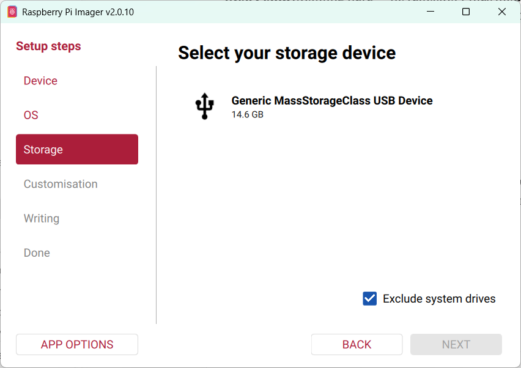
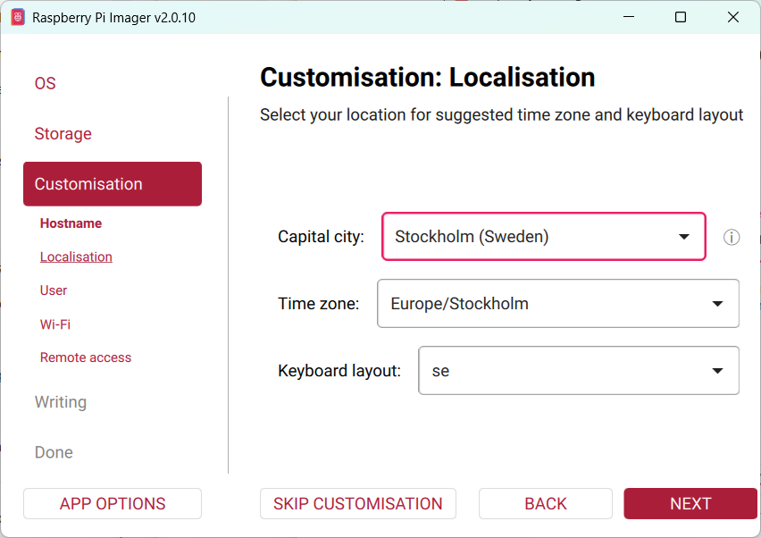
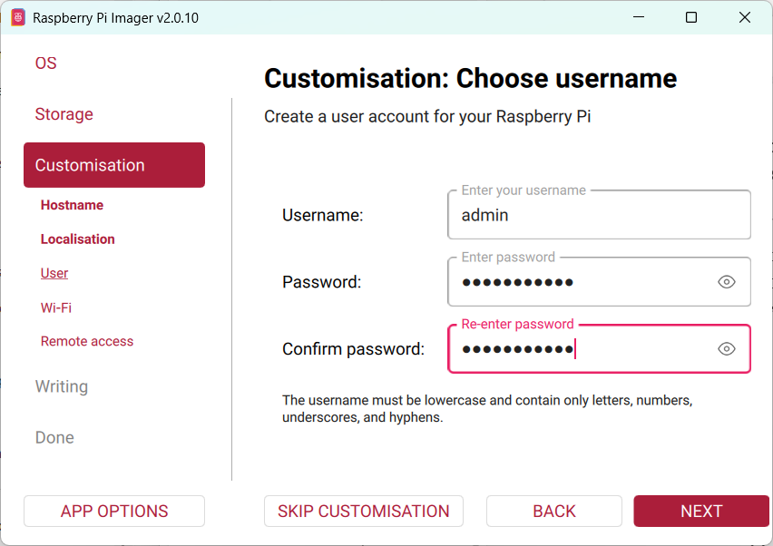
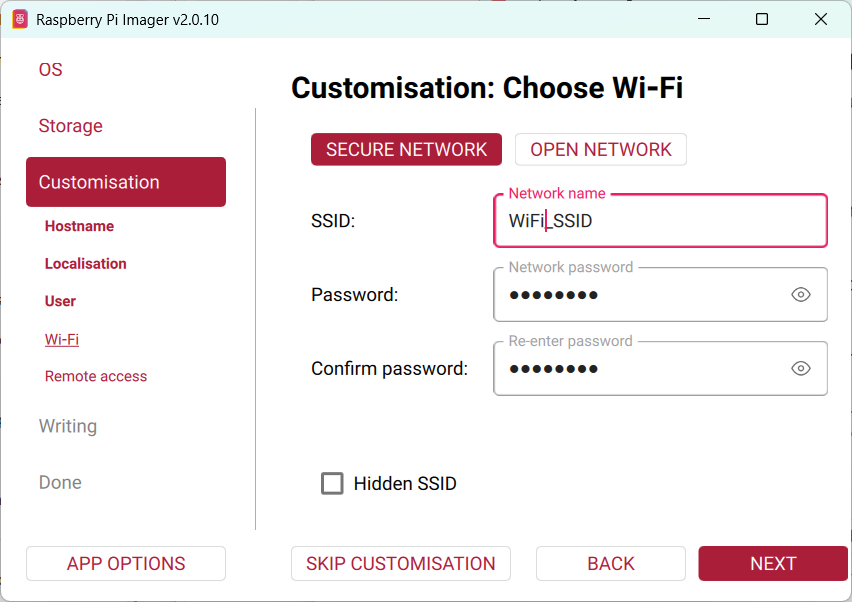
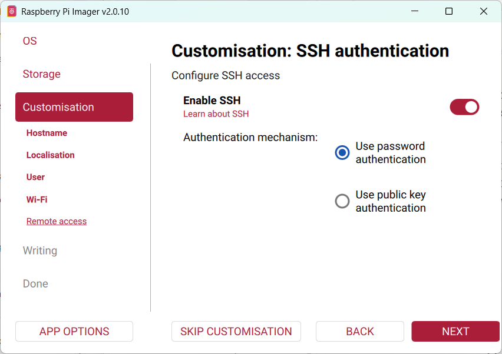
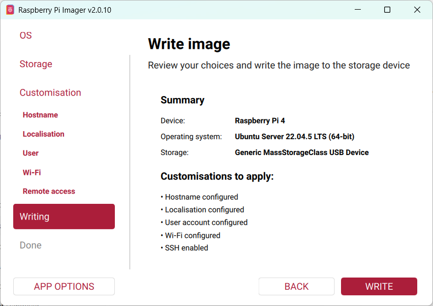

# فصل ۳ — نصب Ubuntu روی Raspberry Pi

## هدف این فصل

در این فصل سیستم عامل Ubuntu را روی Raspberry Pi نصب خواهیم کرد و آن را برای ادامه راهنما آماده می‌کنیم.

در پایان این فصل:

✓ Ubuntu روی Raspberry Pi نصب شده است.

✓ Raspberry Pi به شبکه متصل شده است.

✓ SSH فعال و قابل استفاده است.

✓ می‌توانید از کامپیوتر خود به Raspberry Pi متصل شوید.

✓ سیستم عامل به آخرین نسخه به‌روزرسانی شده است.

## 3.1 چرا Ubuntu؟

**هدف**

درک دلیل انتخاب Ubuntu به عنوان سیستم عامل پیشنهادی.

**چرا؟**

یکی از اولین سؤالاتی که بسیاری از کاربران می‌پرسند این است:

چرا Ubuntu؟ چرا Raspberry Pi OS نه؟

واقعیت این است که CCC و Conduit می‌توانند روی توزیع‌های مختلف لینوکس اجرا شوند.

اما برای این پروژه Ubuntu انتخاب شده است زیرا:

- بسیار شناخته شده و پرکاربرد است.
- مستندات فراوانی دارد.
- پشتیبانی بلندمدت (LTS) ارائه می‌دهد.
- در محیط‌های سروری بسیار رایج است.
- به‌روزرسانی‌های امنیتی منظمی دریافت می‌کند.

در این راهنما تمام مراحل بر اساس Ubuntu 22.04 LTS توضیح داده می‌شوند.

**نکته**

اگر در آینده CCC روی سیستم عامل‌های دیگر نیز اعتبارسنجی شود، مستندات مربوط به آن‌ها به صورت جداگانه ارائه خواهد شد.

## 3.2 در این فصل به چه چیزهایی نیاز داریم؟

**تجهیزات مورد نیاز**

- Raspberry Pi
- کارت حافظه MicroSD
- کارت‌خوان MicroSD
- یک کامپیوتر ویندوز، لینوکس یا macOS
- اتصال اینترنت

## 3.3 Raspberry Pi Imager چیست؟

**هدف**

آشنایی با ابزار رسمی آماده‌سازی کارت حافظه.

**چرا؟**

برای نصب سیستم عامل روی Raspberry Pi باید ابتدا فایل سیستم عامل روی کارت حافظه نوشته شود.

ساده‌ترین روش استفاده از نرم‌افزار رسمی Raspberry Pi Imager است.

**دریافت نرم‌افزار**

وب‌سایت رسمی:

https://www.raspberrypi.com/software/

**اعتبارسنجی**

پس از نصب باید بتوانید Raspberry Pi Imager را اجرا کنید.

*پنجره اصلی Raspberry Pi Imager — ابتدا دستگاه خود را انتخاب کنید.*

## 3.4 انتخاب سیستم عامل

پس از اجرای Raspberry Pi Imager:

**Step 1**

روی:

Choose Device

کلیک کنید.

مدل Raspberry Pi خود را انتخاب کنید.

**Step 2**

روی:

Choose OS

کلیک کنید.

سپس:

Other General Purpose OS

↓

Ubuntu

↓

Ubuntu Server 22.04 LTS (64-bit)

را انتخاب کنید.

**چرا نسخه Server؟**

در این پروژه نیازی به محیط گرافیکی نداریم.

نسخه Server:

- سبک‌تر است.
- منابع کمتری مصرف می‌کند.
- برای اجرای سرویس‌ها مناسب‌تر است.

*انتخاب Ubuntu Server 22.04 LTS (64-bit) از فهرست سیستم‌عامل‌ها.*

## 3.5 انتخاب کارت حافظه

روی:

Choose Storage

کلیک کنید.

کارت حافظه صحیح را انتخاب کنید.

**هشدار**

تمام اطلاعات موجود روی کارت حافظه پاک خواهند شد.

قبل از ادامه از اطلاعات مهم نسخه پشتیبان تهیه کنید.

*انتخاب کارت حافظه مقصد — تمام اطلاعات روی آن پاک می‌شود.*

## 3.6 تنظیمات پیشرفته Raspberry Pi Imager

**هدف**

پیکربندی Raspberry Pi قبل از اولین بوت.

**چرا؟**

اگر این تنظیمات را اکنون انجام دهیم:

- نیازی به مانیتور نخواهیم داشت.
- نیازی به کیبورد نخواهیم داشت.
- SSH از همان ابتدا فعال خواهد بود.

**فعال کردن تنظیمات پیشرفته**

پس از انتخاب سیستم عامل و کارت حافظه:

روی:

Next

کلیک کنید.

سپس:

Edit Settings

را انتخاب کنید.

**Hostname**

پیشنهاد:

conduitpi

یا:

my-conduit-node

**Username**

نمونه:

ubuntu

یا:

conduit

**Password**

یک رمز عبور قوی انتخاب کنید.

مثال مناسب:

حداقل 12 کاراکتر

حروف بزرگ و کوچک

اعداد

نمادها

**SSH**

حتماً فعال کنید:

Enable SSH

روش ورود:

Use password authentication

**Timezone**

منطقه زمانی خود را انتخاب کنید.

مثال:

Europe/Stockholm

**Locale**

مثال:

en_US.UTF-8

**Wi-Fi**

اگر از Wi-Fi استفاده می‌کنید:

- نام شبکه (SSID)
- رمز عبور

را وارد کنید.

اگر از Ethernet استفاده می‌کنید این قسمت ضروری نیست.

در نسخهٔ فعلی Raspberry Pi Imager، پنجرهٔ Edit Settings به چند زبانه تقسیم شده است — General (نام میزبان)، Localisation، User، Wi-Fi و Remote access (SSH). هر بخش را مطابق توضیحات بالا تنظیم کنید؛ این پنل‌ها به این شکل هستند:

*Localisation: منطقه زمانی و چیدمان صفحه‌کلید را تنظیم کنید.*

*User: نام کاربری و رمز عبور حساب را بسازید.*

*Wi-Fi: نام شبکه (SSID) و رمز عبور را وارد کنید (در صورت استفاده از Ethernet لازم نیست).*

*Remote access: SSH را با احراز هویت رمز عبور فعال کنید.*

## 3.7 نوشتن سیستم عامل روی کارت حافظه

پیش از نوشتن، Raspberry Pi Imager خلاصه‌ای از دستگاه انتخابی، سیستم‌عامل و تنظیماتی که اعمال می‌شود را نشان می‌دهد. آن را بررسی کنید و سپس روی Write کلیک کنید.

*خلاصهٔ پیش از نوشتن — پیش از کلیک روی Write، دستگاه، سیستم‌عامل و تنظیمات را بررسی کنید.*

فرآیند نوشتن ممکن است چند دقیقه طول بکشد.

پس از اتمام:

Write Successful

نمایش داده خواهد شد.

## 3.8 اولین بوت

کارت حافظه را داخل Raspberry Pi قرار دهید.

سپس:

- کابل شبکه را متصل کنید.
- یا Wi-Fi را از قبل پیکربندی کرده باشید.
- برق را متصل کنید.

اکنون Raspberry Pi شروع به بوت شدن می‌کند.

**نکته**

اولین بوت ممکن است چند دقیقه طول بکشد.

این موضوع طبیعی است.

## 3.9 پیدا کردن Raspberry Pi در شبکه

**هدف**

یافتن آدرس IP دستگاه.

**روش 1**

ورود به پنل روتر.

بررسی لیست DHCP Clients.

**روش 2**

استفاده از نام میزبان:

conduitpi.local

**روش 3**

ابزارهای اسکن شبکه.

## 3.10 اتصال از طریق SSH

**ویندوز**

PowerShell را باز کنید.

نمونه:

ssh ubuntu@192.168.1.50

یا:

ssh conduit@192.168.1.50

**اولین اتصال**

پیام مشابه زیر مشاهده خواهد شد:

Are you sure you want to continue connecting?

پاسخ دهید:

yes

**اعتبارسنجی**

پس از ورود باید Prompt لینوکس را مشاهده کنید.

مثال:

ubuntu@conduitpi:~$

## 3.11 به‌روزرسانی Ubuntu

**هدف**

اطمینان از نصب آخرین اصلاحات امنیتی.

**اجرا**

sudo apt update

سپس:

sudo apt upgrade -y

**نکته**

بسته به سرعت اینترنت ممکن است چند دقیقه زمان ببرد.

## 3.12 اعتبارسنجی

دستور:

hostnamectl

باید اطلاعات سیستم را نمایش دهد.

دستور:

lsb_release -a

باید نسخه Ubuntu را نمایش دهد.

دستور:

ip addr

باید آدرس IP شبکه را نمایش دهد.

## 3.13 عیب‌یابی

**SSH متصل نمی‌شود**

بررسی کنید:

- Raspberry Pi روشن باشد.
- به شبکه متصل باشد.
- IP صحیح را استفاده کرده باشید.

**Raspberry Pi در شبکه دیده نمی‌شود**

بررسی کنید:

- کابل شبکه متصل باشد.
- Wi-Fi به درستی پیکربندی شده باشد.
- DHCP روتر فعال باشد.

**فرآیند بوت طولانی شده است**

در اولین بوت چند دقیقه انتظار طبیعی است.

اگر بیش از حد طول کشید:

- کارت حافظه را بررسی کنید.
- مجدداً سیستم عامل را بنویسید.

**فصل بعد**

در فصل بعد با تجهیزات شبکه خانگی آشنا خواهیم شد و بررسی می‌کنیم:

- ISP چیست؟
- مودم چیست؟
- روتر چیست؟
- تفاوت مودم و روتر چیست؟
- چرا Port Forwarding روی روتر انجام می‌شود؟
