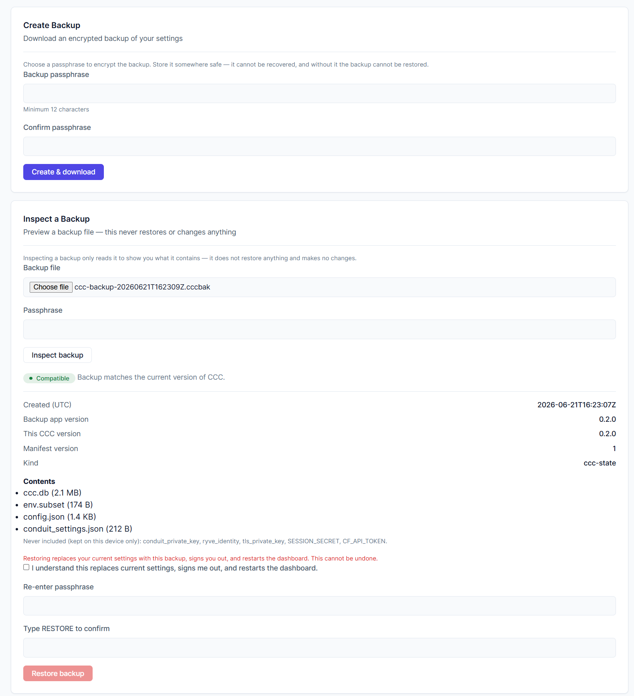

# فصل ۱۲ — Backup & Restore

## هدف این فصل

در فصل‌های قبل با:

- Dashboard
- Advisor
- Conduit Configuration
- Personal Mode
- Ryve Integration

آشنا شدیم.

اکنون به یکی از مهم‌ترین قابلیت‌های عملیاتی CCC می‌رسیم:

Backup & Restore

## در پایان این فصل

✓ خواهید دانست چه چیزهایی Backup می‌شوند.

✓ خواهید دانست چه چیزهایی Backup نمی‌شوند.

✓ Backup رمزنگاری‌شده ایجاد خواهید کرد.

✓ مفهوم Inspect Before Restore را خواهید شناخت.

✓ فرآیند Restore را درک خواهید کرد.

✓ Rollback خودکار را خواهید شناخت.

✓ اقدامات لازم پس از Restore را خواهید دانست.

## 12.1 Backup & Restore چیست؟

**هدف**

درک دقیق فلسفه این قابلیت.

یکی از رایج‌ترین سوءبرداشت‌ها:

Backup

=

Full Raspberry Pi Backup

این تصور اشتباه است.

CCC طراحی شده است تا:

CCC State Recovery

را فراهم کند.

یعنی:

تنظیمات و وضعیت عملیاتی CCC را بازیابی می‌کند.

اما:

Full System Recovery

نیست.

## 12.2 چه چیزهایی Backup می‌شوند؟

**هدف**

شناخت دقیق محتوای Backup.

در نسخه v0.3.0 موارد زیر در Backup قرار می‌گیرند:

**Database**

ccc.db

شامل:

- تنظیمات CCC
- داده‌های عملیاتی
- اطلاعات لازم برای بازیابی

**Configuration**

config.json

**تنظیمات Conduit**

conduit_settings.json

شامل:

- Max Common Clients
- Bandwidth
- Reduced Mode
- Personal Client Limit

**بخش مجاز فایل .env**

بخشی از فایل:

.env

Backup می‌شود.

اما فقط کلیدهای مجاز.

## 12.3 چه چیزهایی Backup نمی‌شوند؟

**هدف**

شناخت محدودیت‌های طراحی.

**هشدار مهم**

⚠️

این موارد عمداً Backup نمی‌شوند.

**Cloudflare API Token**

CF_API_TOKEN

**Session Secret**

SESSION_SECRET

**TLS Private Key**

**Conduit Private Key**

**Ryve Identity**

**Personal Mode Identity**

**فایل**

personal_compartment.json

**دلیل**

محافظت از اطلاعات حساس.

## 12.4 رمزنگاری Backup

**هدف**

درک امنیت Backup.

تمام Backupها رمزنگاری می‌شوند.

الگوریتم:

AES-256-GCM

مشتق‌سازی کلید:

scrypt

**نتیجه**

بدون Passphrase صحیح:

بازیابی Backup ممکن نیست.

## 12.5 انتخاب Passphrase مناسب

**هدف**

حفاظت از Backup.

Passphrase مهم‌ترین بخش فرآیند است.

**هشدار بسیار مهم**

⚠️

اگر Passphrase را فراموش کنید:

Backup Lost Forever

هیچ مکانیزم بازیابی وجود ندارد.

**توصیه**

از:

- Password Manager
- ذخیره امن آفلاین

استفاده کنید.

## 12.6 ایجاد Backup

**هدف**

ساخت نسخه پشتیبان.

مسیر:

Settings

↓

Backup & Restore

↓

Create Backup

سپس:

Passphrase را وارد کنید.

CCC:

Collect

↓

Package

↓

Encrypt

↓

Download

را انجام می‌دهد.

## 12.7 فایل Backup کجا ذخیره می‌شود؟

**پاسخ**

CCC فایل Backup را روی Pi ذخیره نمی‌کند.

فایل مستقیماً به مرورگر ارسال می‌شود.

شما باید آن را:

- ذخیره کنید
- آرشیو کنید
- از آن محافظت کنید

## 12.8 Inspect Before Restore

**هدف**

بررسی Backup قبل از Restore.

یکی از حرفه‌ای‌ترین قابلیت‌های CCC Inspect است.

*Inspect محتوا و سازگاری یک پشتیبان را پیش‌نمایش می‌دهد؛ هرگز بازیابی یا تغییری انجام نمی‌دهد.*

Inspect:

✓ Backup را باز می‌کند.

✓ نسخه را بررسی می‌کند.

✓ محتویات را نمایش می‌دهد.

اما:

✗ Restore انجام نمی‌دهد.

✗ فایل‌ها را تغییر نمی‌دهد.

✗ سیستم را Restart نمی‌کند.

## 12.9 سازگاری نسخه

**هدف**

بررسی Compatibility.

پس از Inspect:

CCC وضعیت سازگاری را نمایش می‌دهد.

**Compatible**

Backup قابل بازیابی است.

**Not Compatible**

Restore مجاز نخواهد بود.

## 12.10 فرآیند Restore

**هدف**

درک مراحل Restore.

Restore به صورت زیر انجام می‌شود:

Upload Backup

↓

Inspect

↓

Compatibility Check

↓

Confirm

↓

Restore

↓

Health Verification

↓

Success

## 12.11 Restore فوری نیست

**هدف**

درک اجرای Background.

Restore یک فرآیند زمان‌بر است.

بنابراین:

Restore Request

↓

202 Accepted

↓

Background Worker

اجرا می‌شود.

رابط کاربری وضعیت را نمایش می‌دهد.

## 12.12 Health Verification

**هدف**

تعیین موفقیت Restore.

**نکته مهم**

موفقیت Restore فقط به معنی اجرای Worker نیست.

موفقیت واقعی System Healthy است.

CCC بررسی می‌کند:

- Dashboard سالم است؟
- سرویس فعال است؟
- سیستم پاسخ می‌دهد؟

## 12.13 Rollback خودکار

**هدف**

محافظت از سیستم.

اگر Restore باعث مشکل شود:

CCC به صورت خودکار:

Rollback

انجام می‌دهد.

**فرآیند**

Restore

↓

Health Check

↓

Failure

↓

Rollback

↓

Health Check

**مزیت**

کاهش احتمال از دست رفتن دسترسی به سیستم.

## 12.14 وضعیت‌های قابل مشاهده

**هدف**

درک Statusها.

**In Progress**

Restore در حال اجرا است.

**Restored**

Restore با موفقیت کامل شده است.

**Rolled Back**

Restore ناموفق بوده و سیستم به وضعیت قبلی بازگشته است.

**Rollback Failed**

Restore ناموفق بوده و Rollback نیز موفق نبوده است.

**Unknown**

وضعیت قابل تشخیص نیست.

## 12.15 بعد از Restore چه کارهایی باید انجام دهم؟

**هدف**

درک اقدامات پس از بازیابی.

**مورد اول**

Cloudflare Token را دوباره وارد کنید.

زیرا:

CF_API_TOKEN

Backup نمی‌شود.

**مورد دوم**

Personal Mode را بررسی کنید.

Identity واقعی Backup نشده است.

ممکن است نیاز به:

Create Identity

داشته باشید.

**مورد سوم**

Ryve Claim را دوباره ایجاد کنید.

Ryve Identity نیز Backup نمی‌شود.

**مورد چهارم**

تنظیمات Conduit را بررسی کنید.

اگرچه CCC تلاش می‌کند آن‌ها را بازگرداند، اما بهتر است صحت آن‌ها را بررسی کنید.

## 12.16 عیب‌یابی

**Passphrase Accepted نمی‌شود**

بررسی کنید:

- Passphrase صحیح باشد.
- فایل Backup آسیب ندیده باشد.

**Restore Available نیست**

بررسی کنید:

Compatible

نمایش داده شده باشد.

**Restore Fail شده است**

لاگ‌ها را بررسی کنید.

**Personal Mode کار نمی‌کند**

ممکن است Identity دوباره ایجاد نشده باشد.

**Cloudflare DDNS کار نمی‌کند**

ممکن است:

CF_API_TOKEN

دوباره وارد نشده باشد.

## 12.17 بهترین شیوه‌ها

**توصیه 1**

پس از هر تغییر مهم:

Backup جدید تهیه کنید.

**توصیه 2**

Backup را روی چند محل ذخیره کنید.

**توصیه 3**

Passphrase را امن نگهداری کنید.

**توصیه 4**

قبل از Restore از Inspect استفاده کنید.

**توصیه 5**

پس از Restore وضعیت Dashboard را بررسی کنید.

## 12.18 نتیجه این فصل

اکنون می‌دانید:

✓ چه چیزهایی Backup می‌شوند.

✓ چه چیزهایی Backup نمی‌شوند.

✓ Backup چگونه رمزنگاری می‌شود.

✓ Inspect چگونه کار می‌کند.

✓ Restore چگونه انجام می‌شود.

✓ Rollback چگونه از سیستم محافظت می‌کند.

✓ بعد از Restore چه اقداماتی لازم است.

**فصل بعد**

در فصل بعد:

System Maintenance & Troubleshooting

را بررسی خواهیم کرد و یاد خواهیم گرفت چگونه سلامت سیستم را حفظ کنیم و مشکلات رایج را برطرف کنیم.
