# فصل ۱۴ — مدل امنیتی (Security Model)

## هدف این فصل

در فصل‌های قبل قابلیت‌های CCC را یاد گرفتیم.

اکنون می‌خواهیم بدانیم:

Why is CCC secure?

و:

How does CCC protect operators and their data?

## در پایان این فصل

✓ فلسفه امنیتی CCC را درک خواهید کرد.

✓ مرزهای اعتماد (Trust Boundaries) را خواهید شناخت.

✓ Authentication و Session Security را خواهید شناخت.

✓ CSRF Protection را خواهید شناخت.

✓ Least Privilege Design را خواهید شناخت.

✓ Secret Management را خواهید شناخت.

✓ امنیت Personal Mode و Ryve را خواهید شناخت.

✓ امنیت Backup & Restore را خواهید شناخت.

## 14.1 فلسفه امنیتی CCC

**هدف**

درک اصول طراحی امنیتی.

CCC بر اساس اصل:

Least Privilege

طراحی شده است.

یعنی:

هر بخش فقط حداقل دسترسی لازم برای انجام وظیفه خود را دارد.

**هدف**

کاهش ریسک:

- نفوذ
- اشتباهات نرم‌افزاری
- آسیب ناشی از Bugها
- افشای اطلاعات حساس

## 14.2 مرزهای اعتماد (Trust Boundaries)

**معماری کلی**

*درخواست‌ها از Cloudflare و Nginx به وب‌اپ غیر-root با نام CCC می‌رسند که تنها از طریق Helperهای اعتبارسنجی‌شده به عملیات دارای امتیاز دسترسی پیدا می‌کند — دسترسی مستقیم root هرگز در اختیار مرورگر قرار نمی‌گیرد.*

**نکته مهم**

CCC مستقیماً تنظیمات سیستمی را تغییر نمی‌دهد.

برای هر عملیات حساس:

Helper اختصاصی استفاده می‌شود.

## 14.3 احراز هویت (Authentication)

**هدف**

جلوگیری از دسترسی غیرمجاز.

CCC از:

Username
+
Password

استفاده می‌کند.

**ذخیره رمز عبور**

رمز عبور به صورت Plain Text ذخیره نمی‌شود.

از:

bcrypt

استفاده می‌شود.

**نتیجه**

حتی در صورت دسترسی به فایل تنظیمات:

رمز عبور واقعی قابل مشاهده نیست.

## 14.4 قفل شدن حساب (Lockout Protection)

**هدف**

مقابله با Brute Force.

پس از:

5

تلاش ناموفق:

حساب برای:

15 minutes

قفل می‌شود.

**بازیابی**

فقط از طریق SSH:

sudo ccc-unlock <username>

## 14.5 امنیت Session

**هدف**

محافظت از نشست کاربر.

پس از Login:

CCC یک Session ایجاد می‌کند.

**ویژگی‌ها**

**HttpOnly**

JavaScript نمی‌تواند Session Cookie را بخواند.

**Secure**

فقط روی HTTPS ارسال می‌شود.

**SameSite=Strict**

ارسال Cookie در درخواست‌های Cross-Site محدود می‌شود.

## 14.6 Sliding Expiration

**هدف**

کاهش ریسک Sessionهای رها شده.

Session دارای زمان انقضا است.

اما:

Active User
↓
Expiration Extended

است.

**مزیت**

کاربر فعال Logout نمی‌شود.

اما Sessionهای رها شده حذف می‌شوند.

## 14.7 CSRF Protection

**هدف**

جلوگیری از درخواست‌های جعلی.

CCC از Double Submit Cookie استفاده می‌کند.

**اجزا**

**Cookie**

csrf_token

**Header**

X-CSRF-Token

**فرآیند**

*CCC در هر درخواست کوکی csrf_token را با هدر X-CSRF-Token مقایسه می‌کند؛ اگر مطابقت داشته باشند درخواست مجاز است، در غیر این صورت با ۴۰۳ Forbidden رد می‌شود.*

در صورت عدم تطابق:

403 Forbidden

## 14.8 مجوزها (Authorization)

**هدف**

محدود کردن دسترسی.

در نسخه v0.3.0:

Single Administrator

مدل استفاده می‌شود.

**نکته مهم**

تقریباً تمام APIها نیاز به Login دارند.

**استثنا**

/api/health

فقط برای بررسی سلامت سرویس استفاده می‌شود.

## 14.9 طراحی Least Privilege

**هدف**

جلوگیری از اجرای همه چیز با root.

CCC با کاربر:

conduit-cc

اجرا می‌شود.

Conduit با:

conduit

اجرا می‌شود.

هیچ‌کدام root نیستند.

## 14.10 معماری Helperها

**هدف**

اجرای امن عملیات حساس.

CCC برای عملیات حساس از Helper استفاده می‌کند.

نمونه‌ها:

ccc-apply-conduit-config

ccc-restore-apply

ccc-personal-compartment

ccc-ryve-claim

**مزیت**

هر Helper:

- ورودی را اعتبارسنجی می‌کند
- مستقل است
- سطح دسترسی مشخص دارد

## 14.11 معماری Sudoers

**هدف**

کنترل دقیق دسترسی‌ها.

CCC از Wildcard استفاده نمی‌کند.

همه دسترسی‌ها:

Exact Path

هستند.

**نمونه**

/opt/conduit-cc/bin/ccc-apply-conduit-config

نه:

/opt/conduit-cc/bin/*

## 14.12 مدیریت Secretها

**هدف**

محافظت از اطلاعات حساس.

Secretها در:

/etc/conduit-cc/.env

نگهداری می‌شوند.

**مجوز فایل**

0600

**نمونه Secretها**

SESSION_SECRET

CF_API_TOKEN

ADMIN_PASSWORD_HASH

## 14.13 امنیت Cloudflare

**هدف**

محافظت از Cloudflare Token.

Token:

CF_API_TOKEN

در فایل .env ذخیره می‌شود.

**ویژگی‌ها**

✓ در URL قرار نمی‌گیرد

✓ در Log ذخیره نمی‌شود

✓ در Backup قرار نمی‌گیرد

## 14.14 امنیت Personal Mode

**هدف**

محافظت از هویت شخصی.

Identity در:

/var/lib/conduit/data

نگهداری می‌شود.

**مجوزها**

0700 Directory
0600 File

**نکته مهم**

Identity در Backup قرار نمی‌گیرد.

## 14.15 امنیت QR شخصی

**هدف**

درک حساسیت Token.

QR شخصی Sensitive Credential است.

**توصیه**

فقط با افراد مورد اعتماد به اشتراک بگذارید.

## 14.16 امنیت Ryve

**هدف**

محافظت از Claim QR.

Ryve QR Private-Key-Grade Data دارد.

**رفتار سیستم**

✓ موقت

✓ فقط در RAM

✓ پاک‌سازی خودکار

✓ عدم ذخیره دائمی

## 14.17 امنیت Backup

**هدف**

محافظت از Backupها.

الگوریتم:

AES-256-GCM

Key Derivation:

scrypt

**نکته مهم**

Passphrase ذخیره نمی‌شود.

## 14.18 موارد حذف‌شده از Backup

**هدف**

جلوگیری از انتقال Secretها.

این موارد Backup نمی‌شوند:

SESSION_SECRET

CF_API_TOKEN

tls_private_key

conduit_private_key

ryve_identity

## 14.19 امنیت Restore

**هدف**

جلوگیری از خراب شدن سیستم.

Restore فقط بر اساس:

Health Verification

موفق تلقی می‌شود.

نه صرفاً بر اساس:

Process Exit Code

## 14.20 Rollback امنیتی

**هدف**

محافظت در برابر Restore خراب.

اگر Restore باعث ناسالم شدن سیستم شود:

Automatic Rollback

اجرا می‌شود.

## 14.21 Security Headers

**هدف**

محافظت از مرورگر.

CCC از Headerهای زیر استفاده می‌کند:

**HSTS**

Strict-Transport-Security

**CSP**

Content-Security-Policy

**Frame Protection**

X-Frame-Options: DENY

**MIME Protection**

X-Content-Type-Options: nosniff

**Referrer Protection**

Referrer-Policy: no-referrer

**Permissions Policy**

camera=()
microphone=()
geolocation=()

## 14.22 بهترین شیوه‌های امنیتی

**توصیه 1**

Passphrase Backup را امن نگهداری کنید.

**توصیه 2**

Cloudflare Token را محدود کنید.

**توصیه 3**

QRهای Personal و Ryve را Secret در نظر بگیرید.

**توصیه 4**

سیستم را به‌روز نگه دارید.

**توصیه 5**

فقط از HTTPS استفاده کنید.

## 14.23 نتیجه این فصل

اکنون می‌دانید:

✓ فلسفه امنیتی CCC چیست.

✓ Authentication چگونه کار می‌کند.

✓ Sessionها چگونه محافظت می‌شوند.

✓ CSRF چگونه کار می‌کند.

✓ Secretها چگونه نگهداری می‌شوند.

✓ Backup چگونه محافظت می‌شود.

✓ Personal Mode و Ryve چگونه ایمن شده‌اند.

✓ Restore چگونه از سیستم محافظت می‌کند.

✓ Security Headers چه نقشی دارند.

### انتشارهای امضاشده و تأیید روی دستگاه

CCC تنها انتشارهایی را نصب می‌کند که توسط ناشر پروژه امضا شده‌اند و پیش از هر عملیات ممتاز به‌صورت fail-closed روی دستگاه، در برابر یک لنگرگاه اعتماد محلی (`/opt/conduit-cc/trust/allowed_signers`) که هرگز درون به‌روزرسانی ارسال نمی‌شود، تأیید می‌گردند. سند تصمیم مرجع **ADR-0003** است. خلاصهٔ کاربری: **[به‌روزرسانی نرم‌افزار و انتشارهای امضاشده](software-updates-and-signed-releases.md)**.

**فصل بعد**

در فصل 15:

Advanced Administration

را بررسی خواهیم کرد و تنظیمات پیشرفته، مدیریت سرویس‌ها، Update، Recovery و عملیات مدیریتی حرفه‌ای را پوشش خواهیم داد.
