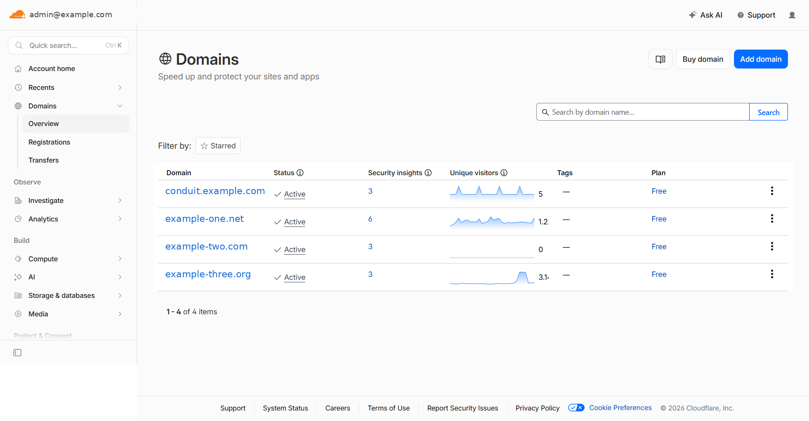
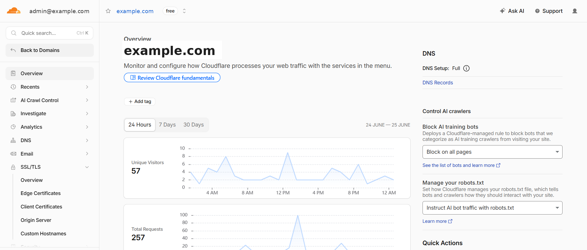
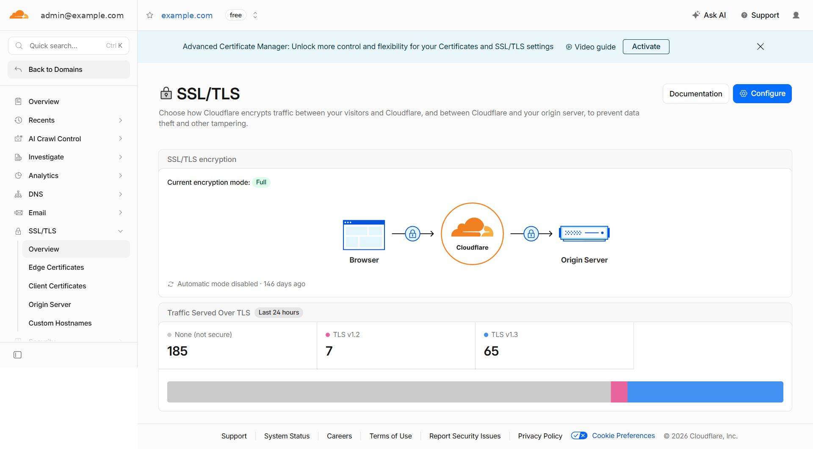
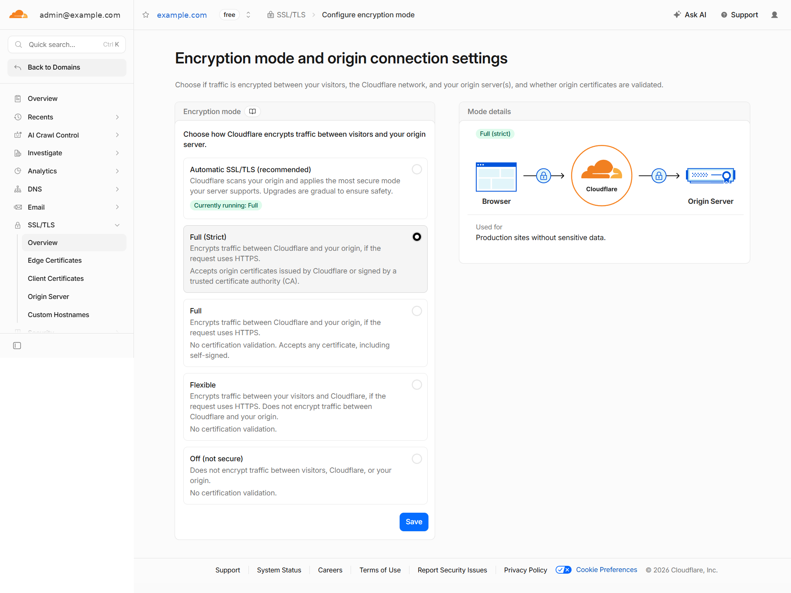
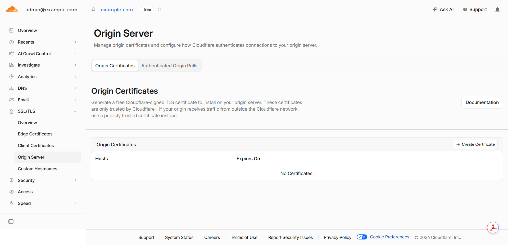
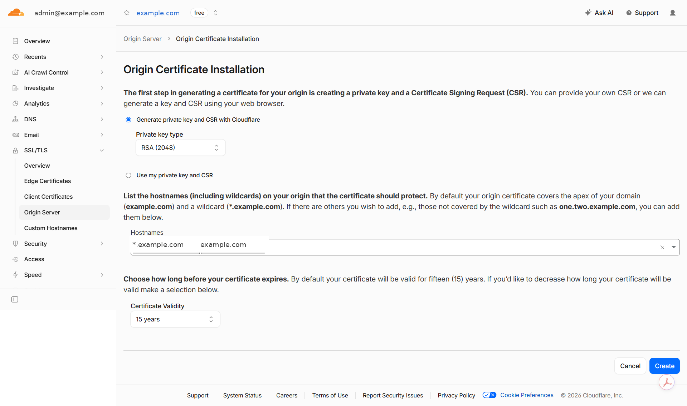
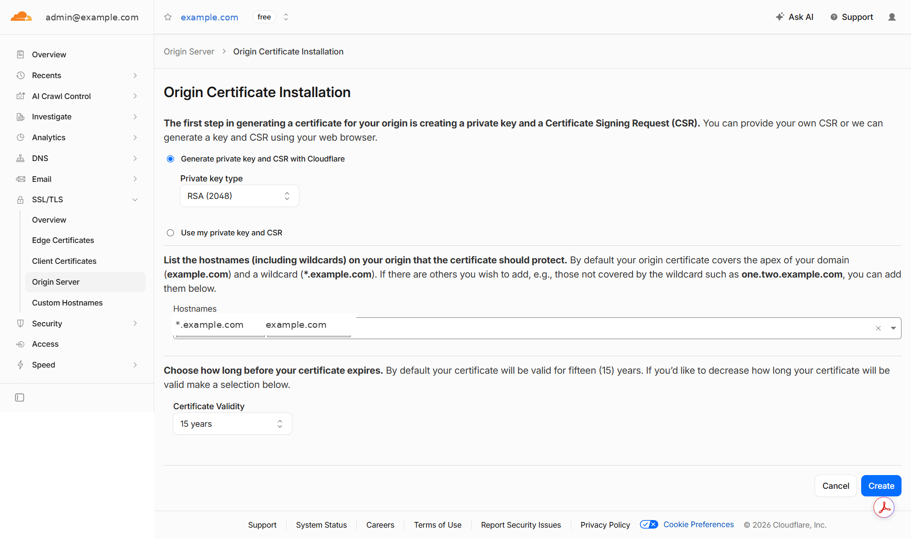
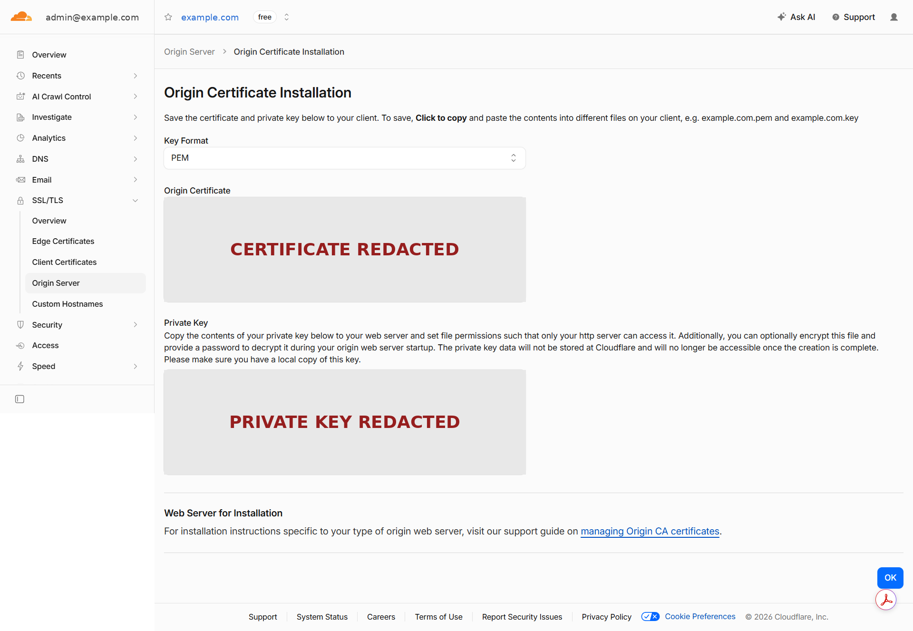

# TLS Certificate Setup

This guide covers certificate installation for Conduit Control Center. There
are two supported paths:

| Path | Difficulty | Installer support |
|---|---|---|
| **Cloudflare Origin Certificate** (recommended) | Beginner | Full — `install.sh` validates and installs |
| **Let's Encrypt** | Advanced | Manual only — `install.sh` cannot validate LE certs |

> **If this is your first time:** use the Cloudflare Origin Certificate path.
> It is simpler, free, does not expire for 15 years, and is fully supported
> by `install.sh`.

---

## Path A — Cloudflare Origin Certificate (recommended)

### What is a Cloudflare Origin Certificate?

A Cloudflare Origin Certificate is a TLS certificate issued by the Cloudflare
CA. It secures the connection between Cloudflare's edge servers and your Pi.

**Important:** this certificate is trusted *only* by Cloudflare, not by
browsers directly. When a visitor opens your dashboard, their browser connects
to Cloudflare (which presents a Cloudflare-issued public certificate the
browser trusts), and Cloudflare connects to your Pi using the Origin
Certificate. This is called the "Full (strict)" SSL/TLS mode.

If the Cloudflare proxy is ever disabled (grey cloud), the browser connects
directly to your Pi and will reject the Origin Certificate with a
`NET::ERR_CERT_AUTHORITY_INVALID` error. Keep the proxy enabled.

### Before You Begin — Configure the Cloudflare SSL/TLS mode to Full (strict)

Before you create the Origin Certificate, set your zone's encryption mode to
**Full (strict)**. This tells Cloudflare to verify the Origin Certificate on
your Pi; without it the certificate you are about to install will not be used.

First confirm your domain is **Active** in Cloudflare.



*Your domain showing "Active" in Cloudflare.*

Open your domain, then choose **SSL/TLS** from the left navigation menu.



*Open your domain, then go to SSL/TLS.*

On the **SSL/TLS → Overview** page you can see the current encryption mode.



*SSL/TLS Overview — the current encryption mode.*

Click **Configure**, select **Full (strict)**, and click **Save**.



*Select **Full (strict)**, then Save.*

With the mode set, you can now create the Origin Certificate.

### A.1 — Create the certificate

Log in to the [Cloudflare dashboard](https://dash.cloudflare.com), select your
zone, and go to **SSL/TLS → Origin Server**.



*SSL/TLS → Origin Server → Create Certificate.*

Click **Create Certificate**. On the first step, let Cloudflare generate the
private key and CSR for you, and set the key type to **RSA (2048)**.



*Let Cloudflare generate the private key — key type **RSA (2048)**.*

Next, enter the hostnames the certificate should cover and choose the validity
period.



*Hostnames (`example.com`, `*.example.com`) and 15-year validity.*

Fill in the wizard as follows:

| Field | Value |
|---|---|
| **Let Cloudflare generate a private key and CSR** | Selected (default) |
| **Key type** | **RSA (2048)** |
| **Hostnames** | Your domain and wildcard, e.g. `example.com, *.example.com` |
| **Certificate Validity** | 15 years (default) |

> ⚠️ **Key type must be RSA (2048). Do not select ECDSA.**
>
> The installer (`install.sh` Phase 1h) validates the private key using
> `openssl rsa`. This command only reads RSA keys. If you choose ECDSA, the
> installer will reject the key with an OpenSSL error. If you already created
> an ECDSA certificate, delete it in the Cloudflare dashboard and create a new
> one with RSA (2048).

Click **Create**. Cloudflare will display:

- **Origin Certificate** — the certificate (public, starts with
  `-----BEGIN CERTIFICATE-----`)
- **Private Key** — the private key (secret, starts with the PEM boundary that
  identifies an RSA private key)

Cloudflare now shows the certificate and the private key on a single screen.



*The certificate and private key are shown only once — copy both now. (Key redacted in this example.)*

⚠️ **The private key is displayed only once.** If you leave this page without
copying it, you cannot retrieve it again and must create a new certificate.

**Leave this browser tab open.** You will need to copy both blocks in the
next step.

### A.2 — Create the certificate directory on your Pi

SSH into your Pi and run:

```bash
sudo mkdir -p /etc/conduit-cc/tls
sudo chmod 700 /etc/conduit-cc/tls
```

### A.3 — Save the certificate and key to the Pi

You need to get the two text blocks from the Cloudflare dashboard into files
on your Pi. Two methods are shown below — use whichever is easier for you.

#### Method 1: paste directly into nano (simplest)

On your Pi, open the certificate file in nano:

```bash
sudo nano /etc/conduit-cc/tls/origin.pem
```

In the Cloudflare browser tab, click inside the **Origin Certificate** box and
select all the text (`Ctrl+A` or `Cmd+A`). Copy it (`Ctrl+C` or `Cmd+C`).

In the nano terminal window, paste the text (`Ctrl+Shift+V` in most Linux
terminals, or `Cmd+V` on macOS). The certificate text should appear, starting
with `-----BEGIN CERTIFICATE-----` and ending with `-----END CERTIFICATE-----`.

Save and close: press `Ctrl+X`, then `Y`, then `Enter`.

Repeat for the private key:

```bash
sudo nano /etc/conduit-cc/tls/origin.key
```

Paste the complete **Private Key** text from the Cloudflare tab, including its
RSA private-key BEGIN boundary and matching END boundary.

Save and close: `Ctrl+X` → `Y` → `Enter`.

#### Method 2: scp from your local machine

If you saved the certificate and key to files on your laptop or desktop first,
copy them to the Pi with `scp`:

```bash
# Run these commands on your LOCAL machine, not the Pi
# Replace pi-hostname with your Pi's hostname or IP address

scp origin.pem your-user@pi-hostname:/tmp/origin.pem
scp origin.key your-user@pi-hostname:/tmp/origin.key
```

Then on the Pi, move the files into place:

```bash
sudo mv /tmp/origin.pem /etc/conduit-cc/tls/origin.pem
sudo mv /tmp/origin.key /etc/conduit-cc/tls/origin.key
```

#### Method 3: WinSCP on Windows (no terminal)

If you are on Windows and prefer not to use a terminal, you can save the two
blocks as files in Notepad and upload them with WinSCP.

First, save each block from the Cloudflare tab using **Notepad → File → Save
As**. In the Save dialog, set **Save as type** to **All Files**, set
**Encoding** to **UTF-8**, and type the exact filename:

- Save the **Origin Certificate** block as `origin.pem`
- Save the **Private Key** block as `origin.key`

Setting **Save as type** to **All Files** is what prevents Notepad from adding a
hidden `.txt` extension.

> ⚠️ **Windows users:** Make sure the files are named:
>
> `origin.pem`  `origin.key`
>
> and **NOT**:
>
> `origin.pem.txt`  `origin.key.txt`
>
> A trailing `.txt` will make the installer reject the files.

Then transfer them to the Pi:

1. Open **WinSCP** and create a **New Site**.
2. Set **File protocol** to **SFTP**, **Host name** to your Pi's IP or hostname,
   **Port** to `22`, and enter your username and password.
3. Connect, then drag `origin.pem` and `origin.key` into **`/tmp`** on the Pi.

Finally, on the Pi, move the files into place:

```bash
sudo mv /tmp/origin.pem /etc/conduit-cc/tls/origin.pem
sudo mv /tmp/origin.key /etc/conduit-cc/tls/origin.key
```

Then set ownership and permissions using **A.4** below.

### A.4 — Set file permissions

```bash
sudo chmod 644 /etc/conduit-cc/tls/origin.pem
sudo chmod 600 /etc/conduit-cc/tls/origin.key
```

The certificate (`.pem`) can be world-readable. The private key (`.key`) must
be readable only by root.

### A.5 — Verify the files

Run all three checks. Each should complete without errors.

**Check 1 — Certificate is readable and shows correct issuer:**

```bash
openssl x509 -noout -issuer -dates -in /etc/conduit-cc/tls/origin.pem
```

Expected output will include:

```
issuer=C=US, O=Cloudflare, Inc., CN=Cloudflare Inc ECC CA-3
notBefore=...
notAfter=...
```

The issuer must contain `Cloudflare`. If the issuer shows `R3`, `E1`, or
`ISRG Root X1`, this is a Let's Encrypt certificate — the installer will
reject it at Phase 1g.

**Check 2 — Private key is RSA and is valid:**

```bash
openssl rsa -noout -check -in /etc/conduit-cc/tls/origin.key
```

Expected output:

```
RSA key ok
```

If you see `unable to load Private Key` or `no start line`, either the file is
empty or the key type is not RSA. Re-create the certificate with key type
RSA (2048).

**Check 3 — Certificate and key are a matching pair:**

```bash
# These two commands must produce the same hash
openssl x509 -noout -modulus -in /etc/conduit-cc/tls/origin.pem | openssl md5
openssl rsa  -noout -modulus -in /etc/conduit-cc/tls/origin.key  | openssl md5
```

Both lines must print the same MD5 hash. If they differ, the certificate and
key are not a matched pair — you may have pasted the wrong key. Re-paste from
the Cloudflare dashboard.

### A.6 — Default file paths

The installer and nginx configuration use these default paths:

| File | Default path |
|---|---|
| Certificate | `/etc/conduit-cc/tls/origin.pem` |
| Private key | `/etc/conduit-cc/tls/origin.key` |

If you want to use different paths, set them in `/etc/conduit-cc/.env`:

```env
TLS_CERT_PATH=/your/custom/path/to/cert.pem
TLS_KEY_PATH=/your/custom/path/to/key.key
```

> **Note:** changing these paths requires also updating the
> `ssl_certificate` and `ssl_certificate_key` directives in the nginx
> configuration (`deployment/conduit-cc.nginx`). The installer does not
> currently support custom TLS paths — use the defaults unless you have a
> specific reason not to.

### A.7 — Return to pre-install.md

With the certificate and key in place and all three verification checks
passing, return to [`docs/pre-install.md`](pre-install.md) Step 6 and
complete the final checklist before running `install.sh`.

---

## Path B — Let's Encrypt (advanced, manual only)

> ⚠️ **Let's Encrypt is not supported by `install.sh`.**
>
> The installer validates TLS certificates by checking that the issuer
> contains `"Cloudflare"` (Phase 1g). Let's Encrypt certificates are issued
> by `R3` or `E1` and will always fail this check. If you run `install.sh`
> with a Let's Encrypt certificate, the installer will stop at Phase 1g.
>
> Let's Encrypt is provided here as a manual alternative for users who cannot
> or do not want to use the Cloudflare proxy. You must configure nginx
> yourself and do not run `install.sh`'s TLS prompts.

### When to use Let's Encrypt

- Your Pi has a public IP and you want browsers to trust the certificate
  without the Cloudflare proxy
- You are connecting directly (no CDN) and want a browser-trusted certificate
- You understand that you are responsible for certificate renewal and nginx
  configuration

### B.1 — Prerequisites for Let's Encrypt

- Your domain's DNS A record points directly to your Pi's IP (proxy must be
  **OFF / grey cloud** for the ACME challenge)
- Port 80 is open on your Pi's firewall and router
- `certbot` is installed: `sudo apt install certbot python3-certbot-nginx`

### B.2 — Obtain the certificate

> ⚠️ **Use `certbot certonly --nginx`, not `certbot --nginx`.**
>
> The `--nginx` plugin (without `certonly`) modifies the nginx server block
> automatically and will overwrite the custom nginx configuration installed by
> this project (which includes Cloudflare real-IP restoration, rate limiting,
> and security headers). Always use `certonly` so certbot only obtains the
> certificate without touching the nginx config.

```bash
sudo certbot certonly --nginx -d conduit.example.com
```

Replace `conduit.example.com` with your actual domain name.

Certbot will place the certificate and key in:

```
/etc/letsencrypt/live/conduit.example.com/fullchain.pem
/etc/letsencrypt/live/conduit.example.com/privkey.pem
```

### B.3 — Configure nginx manually

Edit the nginx configuration to point to the Let's Encrypt certificate paths:

In `/etc/nginx/sites-available/conduit-cc`, update the TLS directives:

```nginx
ssl_certificate     /etc/letsencrypt/live/conduit.example.com/fullchain.pem;
ssl_certificate_key /etc/letsencrypt/live/conduit.example.com/privkey.pem;
```

If you installed from the `deployment/conduit-cc.nginx` template, replace the
`ssl_certificate` and `ssl_certificate_key` lines with the paths above.

Update the nginx configuration template default paths via `.env` if you want
the application to know the new cert location:

```env
TLS_CERT_PATH=/etc/letsencrypt/live/conduit.example.com/fullchain.pem
TLS_KEY_PATH=/etc/letsencrypt/live/conduit.example.com/privkey.pem
```

Test and reload nginx:

```bash
sudo nginx -t && sudo systemctl reload nginx
```

### B.4 — Certificate renewal

Let's Encrypt certificates expire after 90 days. Set up automatic renewal:

```bash
sudo systemctl enable --now certbot.timer
```

Verify the timer is active:

```bash
sudo systemctl status certbot.timer
```

### B.5 — Let's Encrypt and the DDNS script

The DDNS script (`scripts/cloudflare-ddns.sh`) is independent of the TLS path
and works the same way with Let's Encrypt. However:

- With Let's Encrypt, the Cloudflare proxy must be **OFF (grey cloud)** for
  the ACME challenge. Keep it off to maintain a browser-trusted certificate.
- With proxy OFF, the DDNS script still updates your A record to the Pi's
  current IP — this is still useful for keeping DNS accurate.

### B.6 — Future installer support

A future version of `install.sh` may add a Let's Encrypt path. Until then,
Let's Encrypt users are responsible for their own nginx configuration and
certificate renewal.

---

## Choosing between paths

| | Cloudflare Origin Certificate | Let's Encrypt |
|---|---|---|
| Trusted by browsers | Via Cloudflare proxy only | Yes (directly) |
| Expires | After 15 years | After 90 days |
| Auto-renewal | Not needed | Required |
| Installer support | Full | None |
| Cloudflare proxy required | Yes | No (proxy must be off) |
| Difficulty | Beginner | Advanced |

For a Raspberry Pi behind a Cloudflare proxy — which is what this project
assumes — the Cloudflare Origin Certificate path is the correct choice.
