# Chapter 4 — Networking Fundamentals (Part 1)

## Purpose of this chapter

In this chapter we get familiar with the basic networking concepts that are essential for successfully setting up Conduit and CCC.

**By the end of this chapter you will know:**

✓ What an IP Address is

✓ What the difference between Public IP and Private IP is

✓ Why your home Router performs NAT

✓ Why having or not having a Public IP matters for Conduit

## 4.1 What is an IP Address?

**Purpose**

Understanding the concept of an IP Address and its role in the network.

**Why?**

Just as every house has a postal address, every device on the network needs an address in order to communicate. In computer networks, this address is called an **IP Address**.

**Real-world example**

**Suppose in your home there are:**

- A laptop
- A mobile phone
- A smart TV
- A Raspberry Pi

If none of them had an address, the Router could not determine which device the data should be sent to, so each device receives an IP.

**Example:**

Laptop        192.168.1.10

Phone         192.168.1.20

TV            192.168.1.30

Raspberry Pi  192.168.1.50

**Important note**

An IP can be thought of as a house address: just as the address on a letter determines where it is delivered, data on the network is sent to the correct destination using the IP.

*Every device on the home network has its own IP address, which the router uses to deliver data to the right device.*

## 4.2 What is a Public IP?

**Purpose**

Understanding the address that identifies your internet globally.

**Definition**

A Public IP is the address that the ISP assigns to your internet connection. It is the address by which the rest of the internet recognizes you.

**Example**

Suppose the ISP has assigned you this address:

185.201.45.123

**From the internet's point of view:**

You = 185.201.45.123

**Real-world example**

**When you visit a website:**

**https://example.com**

The destination server usually sees the Public IP of your internet connection — not the laptop's IP, and not the phone's IP.

**Important note**

Most homes have only one Public IP, even though dozens of devices may be connected to the network.

*From the internet's perspective, your whole home is reached through a single public IP assigned by your ISP.*

## 4.3 What is a Private IP?

**Purpose**

Understanding the addresses used only inside the home network.

**Definition**

A Private IP is an address used inside your local network. These addresses are not routable on the internet.

**Common ranges**

Most home users see one of these ranges:

192.168.x.x

**or:**

**10.x.x.x**

**or:**

172.16.x.x

**to**

172.31.x.x

**Example**

Laptop        192.168.1.10

Phone         192.168.1.20

Raspberry Pi  192.168.1.50

These addresses are only meaningful inside your home.

**Important note**

Millions of people around the world may use:

192.168.1.50

This causes no problem, because these addresses are valid only on the local network.

**Difference between Public and Private IP**

| Feature | Public IP | Private IP |
| --- | --- | --- |
| Visible on the internet | Yes | No |
| Assigned by the ISP | Yes | No |
| Assigned by the Router | No | Yes |
| Globally unique | Yes | No |

*Private IP addresses are used only inside your home network and are not routable on the internet.*

### 4.3.5 Why is Public IP important for Conduit?

**Purpose**

Understanding the importance of a Public IP for reaching the Raspberry Pi from the internet.

**Why?**

**In the following chapters we will see that:**

- Port Forwarding
- DNS
- Cloudflare
- DDNS

all depend in some way on the Public IP.

**Example**

Suppose someone on the internet wants to connect to your Conduit node. The first thing they must find is **your Public IP**.

**What happens if there is no Public IP?**

Some ISPs use technologies such as **CGNAT**.

**In this case the user may:**

- Not have a dedicated Public IP.
- Not be able to perform Port Forwarding.

**Important note**

Having a Public IP is one of the most important prerequisites for successfully setting up many internet services. The following chapters examine how to determine it.

*A user on the internet reaches your Conduit node through your public IP and your router.*

## 4.4 What is NAT?

**Purpose**

Understanding how multiple devices use a single shared Public IP.

**Definition**

**NAT** stands for **Network Address Translation**. This technology usually runs on your home Router.

**The problem that NAT solves**

**Suppose in your home there are:**

**Laptop**

**Phone**

**TV**

**Raspberry Pi**

But the ISP has provided you with only one Public IP.

**Question:**

**How do four different devices use a single Public IP?**

**Answer:**

**NAT**

**How does NAT work?**

When the Raspberry Pi connects to the internet:

192.168.1.50

the Router receives this request and forwards it to the internet using your home's Public IP.

**So from the internet's point of view:**

185.201.45.123

is communicating.

**Not:**

192.168.1.50

**Simple analogy**

Suppose a company has a single main phone number.

**But inside the company:**

- Sales
- Accounting
- Support

all use that same main number. NAT works in a similar way.

*NAT on the router lets many private devices share one public IP when communicating with the internet.*

**Section validation**

After studying this section you should be able to answer the following questions:

1. What is an IP Address?
2. What is a Public IP?
3. What is a Private IP?
4. What is the difference between Public and Private IP?
5. What problem does NAT solve?
6. Why can multiple devices use a single Public IP?

If you can answer these questions, you are ready to move on to the second part of this chapter.

**Chapter continued**

**In the second part we will learn:**

- What is DHCP?
- Why do device IPs change?
- What is DHCP Reservation?
- Why must the Raspberry Pi always have a fixed IP?
- How does Port Forwarding work?
- How do we verify the configuration is correct?
