# Chapter 5 — Domains, DNS, and Cloudflare

## Purpose of this chapter

In the previous chapters we:

- Prepared the Raspberry Pi.
- Installed Ubuntu.
- Learned networking concepts.

Now we need to learn how to use a simple, memorable name to reach our node.

By the end of this chapter you will know:

✓ What a Domain is

✓ What DNS is

✓ What a Subdomain is

✓ What Cloudflare is

✓ Why CCC uses Cloudflare

✓ What an API Token is

✓ What Dynamic DNS is

✓ How to prepare a Subdomain for our node

## 5.1 What is a Domain?

**Purpose**

Understanding the concept of a domain and its role on the internet.

**Why?**

When you visit a website, you usually type something like:

google.com

github.com

wikipedia.org

Computers, however, actually work with IP addresses — for example:

142.250.74.14

Because IP addresses are hard to remember, we use a Domain instead.

**Domain in simple terms**

A Domain is a human-readable name that points to an IP. For example:

google.com

is really a friendly name for finding Google's servers.

**Simple analogy**

Suppose you want to call someone. Which is easier to remember?

Ali

or:

+46-72-xxx-xxxx

A contact name is easier for a human, and a Domain plays a similar role for the internet.

*A domain name is a human-friendly label that stands in for a numeric IP address.*

## 5.2 What is DNS?

**Purpose**

Understanding the system that converts a Domain into an IP.

**DNS in simple terms**

DNS stands for Domain Name System. You can think of it as the internet's phone book.

**Example**

When you type the following in the browser:

example.com

your computer asks DNS:

What is the IP for example.com?

DNS answers:

203.0.113.10

and the browser then connects to that IP.

**What would happen without DNS?**

You would have to memorize the IP of every website — for example:

185.199.108.153

140.82.121.3

104.18.32.7

which is practically impossible.

*DNS translates a domain name into an IP address, which the browser then connects to.*

## 5.3 What is a Subdomain?

**Purpose**

Understanding the concept of a subdomain.

**Example**

Suppose you have the following domain:

example.com

You can create various subdomains:

www.example.com

mail.example.com

vpn.example.com

conduit.example.com

**Why is a Subdomain important?**

In this project we will usually use something like:

conduit.example.com

This lets users rely on a fixed name instead of memorizing an IP.

**Simple analogy**

If we think of a Domain as a building:

example.com

then subdomains are the different units of that building.

mail.example.com

support.example.com

conduit.example.com

*Subdomains are named units organized under a single parent domain.*

## 5.4 What is Cloudflare?

**Purpose**

Getting familiar with the service we will use in this guide.

**Cloudflare in simple terms**

Cloudflare provides a set of internet services, including:

- DNS
- Security
- TLS
- Domain management
- API
- Dynamic DNS

**Why does CCC use Cloudflare?**

There are a few important reasons:

**Simplicity**

Setting up DNS is very easy.

**Free of charge**

A large part of the required features is available in the free plan.

**API**

CCC can update DNS records automatically.

**Stability**

Cloudflare is one of the largest internet service providers in the world.

**Important note**

Using Cloudflare is recommended but not required; other methods may be added in the future.

## 5.5 What is Dynamic DNS?

**Purpose**

Understanding the problem that Dynamic DNS solves.

**The problem**

In many homes the ISP does not provide a fixed IP.

Today:

185.10.20.30

Tomorrow:

185.44.55.66

If DNS keeps pointing to the old IP, users can no longer reach your node.

**The solution**

Dynamic DNS

**How does Dynamic DNS work?**

CCC periodically checks the Public IP, and if it has changed, it updates Cloudflare. As a result:

conduit.example.com

will always point to the correct IP.

*Dynamic DNS keeps your domain pointed at your home's current public IP as it changes.*

## 5.6 What is an API Token?

**Purpose**

Understanding how CCC communicates with Cloudflare.

**What is an API?**

An API is a way through which software programs talk to each other.

**Example**

When CCC wants to change a DNS record, it must send a request to Cloudflare, and Cloudflare must make sure the request is authorized.

**The solution**

API Token

**API Token in simple terms**

An API Token is like a digital key: whoever holds it can perform certain operations.

**Security warning**

⚠️

Never:

- Publish your API Token on GitHub
- Show it in images
- Send it to others

## 5.7 Minimum required permissions

**Important principle**

CCC follows the principle of:

Least Privilege

That is, it obtains only the minimum access it needs.

**Required permissions**

Usually:

Zone

DNS

Edit

is enough.

**Why does it matter?**

If the Token is compromised, the attacker will only have access to the DNS of that Zone — not to the entire Cloudflare account.

## 5.8 What will we have by the end of this chapter?

At this stage we have not yet configured Cloudflare, but we now know:

✓ What a Domain is

✓ What DNS is

✓ What a Subdomain is

✓ What Cloudflare is

✓ What Dynamic DNS is

✓ What an API Token is

**Validation**

You should be able to answer these questions:

1. What does DNS do?
2. What is the difference between a Domain and an IP?
3. What is a Subdomain?
4. Why is Cloudflare used?
5. What problem does Dynamic DNS solve?
6. What is an API Token?
7. Why should the Token not be published?

**Next chapter**

In the next chapter we create a Cloudflare account and:

- Add the Domain.
- Check the Zone.
- Create an API Token.
- Prepare the Subdomain required by CCC.

Chapter 5 — Domains, DNS, and Cloudflare (Part 2)

## Purpose of this chapter

In the previous chapter we got familiar with the concepts:

- Domain
- DNS
- Subdomain
- Cloudflare
- API Token
- Dynamic DNS

Now we want to prepare Cloudflare for use with CCC.

By the end of this chapter:

✓ The domain is managed in Cloudflare.

✓ The DNS record required by CCC is created.

✓ An API Token with minimum access is created.

✓ Dynamic DNS is ready to use.

✓ You know how CCC updates Cloudflare.

## 5.9 Creating a Cloudflare account

**Purpose**

Creating a Cloudflare account to manage DNS.

**Why?**

CCC uses Cloudflare for:

- DNS
- Dynamic DNS

So we first need a Cloudflare account.

**Steps**

1. Go to the Cloudflare website.
2. Create a user account.
3. Confirm your email.

**Validation**

You should be able to log in to the Cloudflare Dashboard.

**Screenshot needed**

cloudflare-signup.png

## 5.10 Adding the domain to Cloudflare

**Purpose**

Managing the domain's DNS through Cloudflare.

**Prerequisite**

You must:

- Have a registered domain.

Example:

example.com

**Important note**

Cloudflare does not register the domain; it manages its DNS.

**General steps**

1. Add the domain to Cloudflare.
2. Obtain the Nameservers provided by Cloudflare.
3. Set them at the domain's Registrar.

**Validation**

After completing the process, the domain should have the following status in Cloudflare:

Active

**Screenshot needed**

cloudflare-domain-active.png

## 5.11 What is a DNS record?

**Purpose**

Understanding how a domain name connects to a destination.

**Example**

Suppose:

conduit.example.com

exists. For this name to be usable, we must have a DNS record.

**A Record**

In the current version of CCC:

A Record

is used.

**Important note**

Version v0.3.0 supports only:

IPv4

A Record

**Currently not supported**

AAAA Record

IPv6 DDNS

## 5.12 Creating the Conduit record

**Purpose**

Creating the record that CCC will update.

**Example**

Domain:

example.com

Record:

conduit.example.com

**Record type**

A

**Initial value**

Any valid IPv4.

Example:

203.0.113.10

This value will later be updated by DDNS.

**Screenshot needed**

cloudflare-a-record.png

## 5.13 Why must the record be Proxied?

**Purpose**

Understanding one of CCC's most important requirements.

**Very important note**

At install time, CCC checks that the DNS record's:

Proxy Status

=

Proxied

**Orange Cloud**

The correct state:

🟧 Proxied

**Grey Cloud**

The invalid state for installation:

☁ DNS Only

**What happens if it is Grey Cloud?**

CCC installation stops.

**Validation**

You should see in Cloudflare:

Proxy Status

=

Proxied

**Screenshot needed**

cloudflare-orange-cloud.png

## 5.14 Creating an API Token

**Purpose**

Allowing CCC to update the DNS record.

**Why an API Token?**

CCC must be able to:

- Read the DNS record
- Update the DNS record

**Security principle**

CCC uses the principle of:

Least Privilege

**Required permissions**

Only:

Zone

Zone

Read

and:

Zone

DNS

Edit

**Access scope**

Only the domain in use.

Example:

example.com

**What should we not use?**

❌ Global API Key

**Why?**

It has very broad access.

**Validation**

After creating the Token, keep it in a safe place.

**Warning**

⚠️

The Token is shown only once.

**Screenshot needed**

cloudflare-token-permissions.png

## 5.15 How does CCC use Cloudflare?

**Purpose**

Understanding the actual operation of DDNS.

**What information does CCC need?**

Three values:

CF_API_TOKEN

CF_ZONE_NAME

CF_RECORD_NAME

**Example**

CF_ZONE_NAME=example.com

CF_RECORD_NAME=conduit.example.com

**Important note**

The user does not enter the Zone ID; CCC finds it automatically.

**Reason**

Reducing configuration complexity.

## 5.16 How does Dynamic DNS work?

**Purpose**

Understanding the automatic update process.

**The process**

Every 5 minutes, CCC:

1. Checks the current Public IPv4.
2. Checks the current DNS record.
3. Compares them.

**If the IP has not changed**

no_change

is recorded.

**If the IP has changed**

Cloudflare is updated, and:

updated

is recorded.

*CCC periodically checks the public IP and updates the Cloudflare DNS record whenever it changes.*

## 5.17 Validation

**Viewing the settings**

sudo grep -E '^CF_(ZONE_NAME|RECORD_NAME)=' /etc/conduit-cc/.env

**Checking the DDNS schedule**

crontab -u conduit-cc -l

**Viewing the logs**

tail -n 20 /var/log/conduit-cc/ddns.log

**Running manually**

sudo -u conduit-cc /usr/local/bin/cloudflare-ddns.sh

**Checking the latest result**

tail -n 1 /var/log/conduit-cc/ddns.log

## 5.18 Important note about dig

Many users expect:

dig +short conduit.example.com

to display the Raspberry Pi's real IP, but this is not always the case.

**But this is not always true**

If:

Proxy Status = Proxied

then Cloudflare may display its own IPs instead.

**Result**

This behavior is normal and is not a sign of DDNS failure.

## 5.19 Troubleshooting

**DDNS does not update**

Check that:

- The Token is valid.
- The DNS record exists.
- Cloudflare is reachable.

**Installation stops**

Check that:

Proxy Status

=

Proxied

**Token error**

Check that:

Zone → Zone → Read

Zone → DNS → Edit

have been granted.

**An error log is seen**

Check:

tail -n 50 /var/log/conduit-cc/ddns.log

**Conclusion of this chapter**

Now:

✓ The domain is ready.

✓ Cloudflare is ready.

✓ The DNS record is ready.

✓ The API Token is ready.

✓ DDNS is ready to use.

And we can move on to the actual installation of CCC.

**Next chapter**

In the next chapter we will begin the actual installation of Conduit Control Center on the Raspberry Pi.
