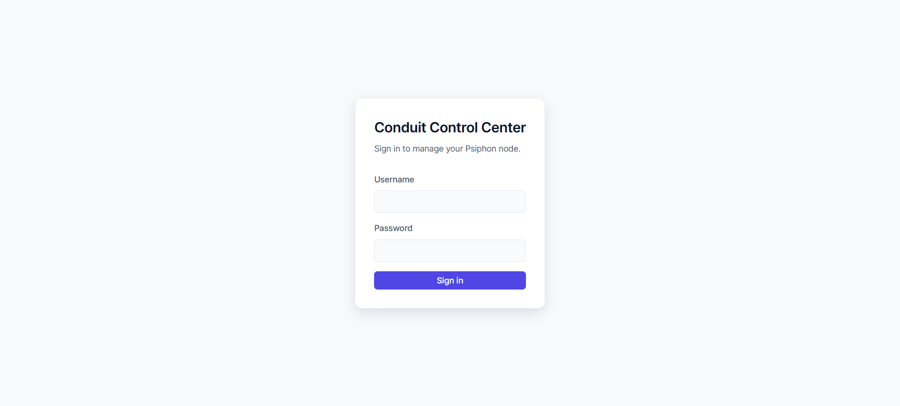
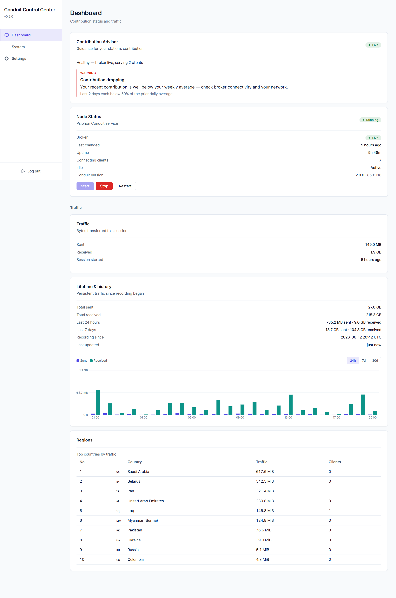

# Chapter 7 — First Login and Dashboard Tour

## Purpose of this chapter

In the previous chapter we installed CCC. Now we will enter the Dashboard for the first time.

By the end of this chapter:

✓ You will log in to CCC.

✓ You will understand the structure of the Dashboard.

✓ You will know the difference between the Dashboard, System, and Settings sections.

✓ You will get familiar with the Contribution Advisor.

✓ You will understand the concept of Traffic, Regions, and Node Status.

✓ You will know which section each capability is in.

## 7.1 First login

**Purpose**

Logging in to the Dashboard for the first time.

**Dashboard address**

If you used conduit.example.com in the previous chapter, the Dashboard will be available at:

https://conduit.example.com

**Login page**

Opening the address above displays the Login page.

**Login credentials**

Use the credentials you defined during installation:

Admin Username

Admin Password



*The CCC login screen.*

## 7.2 Login security

**Purpose**

Understanding the system's security behavior.

**Number of failed attempts**

CCC protects against password-guessing attacks.

**Limit**

After:

5

failed attempts, the account is locked for:

15 Minutes

**What to do if you are locked out?**

Connect to the Raspberry Pi via SSH and run:

sudo ccc-unlock admin

**Important note**

Replace admin with the actual admin username.

**Validation**

After unlocking, you should be able to log in again.

## 7.3 Dashboard structure

**Purpose**

Understanding the main structure of the user interface.

CCC is a single-page application, so switching between sections usually does not reload the page.

**Main menu**

Version v0.3.0 has only three main sections:

Dashboard

System

Settings



*The CCC dashboard after login — node status, advisor, traffic, and aggregate regions, all in the browser.*

## 7.4 The Dashboard section

**Purpose**

Viewing the overall status of the Conduit station.

This is usually the page where you will spend the most time.

**Main components**

Contribution Advisor

Node Status

Traffic

Lifetime & History

Traffic History

Regions

## 7.5 Contribution Advisor

**Purpose**

Helping to optimize the station's contribution level.

The Advisor automatically analyzes the station's status.

**Items checked**

Example:

CPU Usage

RAM Usage

Temperature

Client Capacity

Activity Patterns

**Types of recommendations**

From least to most important:

Info

Suggestion

Strong Suggestion

Warning

**Example**

If the Raspberry Pi's temperature rises, the Advisor may display a warning. If the client capacity is near its ceiling, it may suggest increasing capacity.

**Important note**

The Advisor only makes suggestions; no change is applied automatically.

## 7.6 Node Status

**Purpose**

Displaying the current status of Conduit.

**Possible states**

Live

Starting

Disconnected

Offline

Unknown

**Meaning of the states**

**Live**

Conduit is running and responsive.

**Starting**

The service is starting up.

**Disconnected**

The connection to the service is not established.

**Offline**

The service is not active.

**Unknown**

The status cannot be determined.

## 7.7 Traffic

**Purpose**

Displaying the current session's traffic.

This section displays only the traffic since the current startup of Conduit.

**Information displayed**

Upload

Download

**Important note**

When Conduit is restarted, these numbers are reset.

## 7.8 Lifetime & History

**Purpose**

Displaying persistent statistics.

Unlike the current Traffic, this section keeps information over time.

**Sample information**

Lifetime Upload

Lifetime Download

**Important note**

This capability depends on the Traffic Collector. If the Traffic Collector is not enabled, you may not see any data — this does not mean CCC is broken.

## 7.9 Traffic History

**Purpose**

Displaying the activity trend over time.

In this section you see charts that show:

Yesterday

Last Week

Historical Activity

**Use**

It helps you identify:

- Growth trends
- Peak activity times
- Usage patterns

## 7.10 Regions

**Purpose**

Displaying the geographic distribution of traffic.

CCC displays only aggregate information.

**Important note**

CCC does not display:

IP Addresses

User Identity

User Names

**Design philosophy**

Aggregate Only

Preserving users' privacy.

## 7.11 The System section

**Purpose**

Displaying the system's health.

This section contains:

System Health

DDNS Status

Logs

## 7.12 System Health

**Information displayed**

CPU

RAM

Temperature

Disk Usage

**Use**

Quickly identifying hardware problems.

## 7.13 DDNS Status

**Purpose**

Checking the status of Cloudflare DDNS.

Sample information:

Last Update

Last Result

Consecutive Errors

**Common results**

updated

no_change

error

## 7.14 Logs

**Purpose**

Viewing Conduit's logs.

This section displays the last:

200

log lines.

**Refresh button**

For reloading the logs.

**Important note**

Sensitive information is automatically removed or hidden.

## 7.15 The Settings section

**Purpose**

Configuring and managing CCC.

This section contains:

Change Password

Appearance

Backup & Restore

Conduit Configuration

Personal Mode

Ryve

## 7.16 Change Password

**Purpose**

Changing the admin password.

It is recommended that you change the default password after your first login.

## 7.17 Appearance

**Purpose**

Choosing the user interface appearance.

**Available modes**

Dark

Light

System

**System**

Matches the operating system or browser settings.

## 7.18 Backup & Restore

**Purpose**

Backing up and restoring settings.

Available operations:

Create Backup

Inspect Backup

Restore Backup

**Important note**

Restore is a sensitive operation; the Backup is inspected first.

## 7.19 Conduit Configuration

**Purpose**

Managing Conduit settings.

This section has two important concepts.

**Configured**

Settings that have been saved.

**Effective**

Settings that are currently used by Conduit.

**Why might they differ?**

Because some changes are applied only on the next startup.

## 7.20 Personal Mode

**Purpose**

Creating a personal space for private use.

In this section you can:

- Create an Identity.
- Generate a QR Pairing.
- Set the number of personal clients.

**Common states**

Not Set Up

Created

Active

## 7.21 Ryve

**Purpose**

Managing the Claim related to Ryve.

This section lets you:

Generate Claim

Show QR

Remove Claim

**Security warning**

The generated QR must be treated like a Secret.

## 7.22 The Software Updates section

**Purpose**

Check for and install Conduit Control Center updates from the dashboard, without using the command line. Updates are always started by you — there is no automatic or background updating.

**Scope**

This updates Conduit Control Center only. It does not update Psiphon Conduit (the Core), which is managed separately.

**What it shows**

- Current — the version you are running.
- Latest — the newest stable version available.
- Status — whether you are up to date or an update is available.
- Last checked — when CCC last contacted GitHub.
- What's new — a short preview of the release notes.

Updates come only from official, stable published releases.

**Checking for updates**

CCC checks automatically at most once a day. You can also select Check Now at any time.

**Installing an update**

When an update is available, select Install Update. CCC downloads the new version, applies it, and the dashboard restarts and reconnects automatically — after a short wait it shows the new version. Your settings, TLS certificate, and data are preserved. If anything goes wrong, CCC automatically rolls back to the previous version.

**Conduit Core notice**

If a release recommends a newer Conduit Core than the one installed, a notice appears with Continue Anyway and Cancel. You decide. Continuing updates Conduit Control Center only — Conduit Core is not changed.

**If GitHub cannot be reached**

CCC shows the last known result and keeps working. You can still update manually over SSH.

**First update is manual**

The one-click updater becomes available only after you are running a version that includes it. The first time, update once over SSH:

```bash
cd ~/conduit-control-center
git pull
sudo bash update.sh
```

After that, future updates can be done from this screen.

## 7.23 Logging out

**Purpose**

Ending the management session.

To log out, select Logout.

**Recommendation**

On shared computers, always log out.

## 7.24 Conclusion of this chapter

Now:

✓ You have logged in to CCC.

✓ You know the structure of the Dashboard.

✓ You know the difference between Dashboard, System, and Settings.

✓ You are familiar with the Advisor.

✓ You know the Node status.

✓ You know where Personal Mode is.

✓ You know where Ryve is.

✓ You know where Backup & Restore is.

### Software Updates

The **Software Updates** page updates CCC from the dashboard with one action and shows whether you are up to date. CCC verifies each update's signature before applying it and rolls back automatically if a new version does not become healthy. See **[Software Updates & Signed Releases](software-updates-and-signed-releases.md)**.

<!-- SCREENSHOT NEEDED: SU-02 — Software Updates page, update available -->

**Next chapter**

In the next chapter we will examine the Contribution Advisor in more detail and see how to interpret its recommendations.
