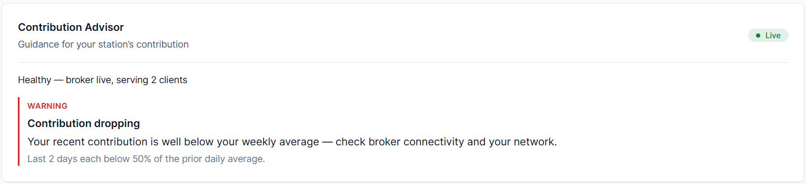

# Chapter 8 — Understanding the Contribution Advisor

## Purpose of this chapter

In the previous chapter we got familiar with the Dashboard. One of its most important parts is the:

Contribution Advisor

The Advisor helps you better understand the status of your station and make more informed decisions.

By the end of this chapter you will know:

✓ What the Contribution Advisor is

✓ How recommendations are generated

✓ What the different warning levels mean

✓ How to interpret Capacity recommendations

✓ How to interpret Reduced Mode recommendations

✓ How to interpret Health warnings

✓ What the Advisor does not do

## 8.1 What is the Contribution Advisor?

**Purpose**

Understanding the Advisor's role in CCC.

The Advisor is an analytical system that checks the system status, the Conduit status, and the traffic pattern, and then provides recommendations.

**Important note**

The Advisor is not an automatic decision-making system.

**Important rule**

Advisor

≠

Automation

The Advisor only makes suggestions.

It does not apply any change automatically.

## 8.2 The Advisor's design philosophy

**Purpose**

Understanding the Advisor's design approach.

The Advisor is designed based on three principles:

**First principle**

Helping increase contribution

**Second principle**

Preventing excessive load on the Raspberry Pi

**Third principle**

Keeping it simple

**Example**

The Advisor may suggest:

Raise Client Limit

but it does not apply this change itself.

The user must:

- Review the suggestion
- Decide
- Change the settings if desired

## 8.3 The information the Advisor checks

**Purpose**

Knowing the data used.

The Advisor checks the following data.

**System resources**

CPU Usage

RAM Usage

CPU Temperature

**Conduit status**

Connected Clients

Maximum Clients

Idle Time

Broker Status

Uptime

**Traffic information**

Lifetime Upload

Lifetime Download

Last 24 Hours

Last 7 Days

Hourly History

**Important note**

All information is:

Aggregate Only

The Advisor never checks:

- Users' IPs
- Users' identities
- Individual users' activity

## 8.4 Recommendation severity levels

**Purpose**

Understanding Severity Levels.

The Advisor has four severity levels.

*The Advisor presents guidance with a severity level; here a warning that contribution is dropping.*

**Warning**

The highest severity level.

Example:

CPU Too High

Broker Disconnected

**Recommended**

A strong suggestion.

Example:

Raise Client Limit

in very favorable conditions.

**Suggestion**

An ordinary suggestion.

Example:

Consider Reduced Mode

**Info**

General information.

Example:

New Station

## 8.5 Capacity recommendations

**Purpose**

Understanding capacity-related recommendations.

Capacity determines how many clients can use your station simultaneously.

### 8.5.1 When is a capacity-reduction warning given?

If any of the following conditions hold:

CPU > 90%

RAM > 85%

Temperature ≥ 80°C

the Advisor warns:

Reduce Client Limit

**Reason**

Preventing system instability.

### 8.5.2 When is a capacity-increase suggestion given?

The Advisor only suggests increasing capacity when:

**Conduit is active**

Live

**Demand is high**

Connected Clients

≥

80% Of Capacity

**CPU is low**

CPU < 40%

**RAM is low**

RAM < 70%

**Temperature is suitable**

Temperature < 70°C

If a temperature sensor does not exist, this condition is ignored.

**Conditions are stable**

The Advisor does not rely on the momentary status alone; the favorable conditions must have been maintained for a period.

**Enough time has passed**

Between two capacity-increase suggestions:

24 Hours

of spacing exists.

### 8.5.3 Capacity-increase formula

The Advisor uses the following formula:

Current Limit

+

25%

but:

**Minimum increase**

25 Clients

**Maximum increase**

100 Clients

**Final ceiling**

1000 Clients

**Example**

If:

Current Limit = 200

the Advisor suggests:

250

If:

Current Limit = 600

the Advisor suggests:

700

## 8.6 Reduced Mode recommendations

**Purpose**

Understanding recommendations related to low-traffic hours.

Reduced Mode is a capability in Conduit that applies more conservative limits during low-traffic hours.

**How does the Advisor decide?**

The Advisor needs at least:

7 Days

of history.

If there is not enough data:

no recommendation is provided.

**Analysis of low-traffic hours**

The Advisor checks hourly activity, calculates the Median, and finds the low-traffic hours, then suggests the longest quiet window.

**Example**

It may suggest:

01:00 UTC

to

07:00 UTC

**Suggestion strength**

If the window is very stable:

Recommended

Otherwise:

Suggestion

**Important note**

The Advisor only suggests the window.

Enabling Reduced Mode is still done by the user.

## 8.7 System health assessment

**Purpose**

Understanding the Health states.

The Advisor always displays a Summary.

**Live**

Broker Live

and the system is healthy.

**Disconnected**

The connection to the Broker is not established.

**Offline**

No data is received from Conduit.

**Unknown**

The status cannot be determined.

## 8.8 Health warnings

**Broker Disconnected**

Level:

Warning

**Contribution Dropping**

If recent activity is noticeably below the previous average.

Level:

Warning

**New Station**

The station has just been set up.

Level:

Info

**No Recent Traffic**

No activity has been seen for a long period.

Level:

Suggestion

## 8.9 How often is the Advisor updated?

**Purpose**

Understanding the Refresh behavior.

While the Dashboard is active:

every:

60 Seconds

it updates the Advisor.

**Important note**

If the Dashboard is not open:

the Advisor is not polled.

## 8.10 What does the Advisor not do?

**Purpose**

Preventing misunderstanding.

The Advisor:

❌ Does not change settings.

❌ Does not increase Capacity.

❌ Does not enable Reduced Mode.

❌ Does not Restart services.

❌ Does not change Conduit.

The Advisor only:

Observe

Analyze

Recommend

## 8.11 Real-world examples

**Example 1**

CPU:

95%

Advisor:

Warning

Reduce Client Limit

**Example 2**

Clients:

90%

Of Capacity

CPU:

20%

RAM:

35%

Advisor:

Recommended

Raise Client Limit

**Example 3**

7 days of history are available.

Every night the activity is very low.

Advisor:

Reduced Mode Suggestion

## 8.12 Conclusion of this chapter

Now you know:

✓ How the Advisor works.

✓ What a Capacity Recommendation is.

✓ What a Reduced Mode Recommendation is.

✓ What a Health Recommendation is.

✓ What Severity Levels mean.

✓ What the Advisor does not do.

**Next chapter**

In the next chapter we will examine the:

Conduit Configuration

section and learn how to apply the Advisor's recommendations in practice.
