# Chapter 11 — Ryve Integration

## Purpose of this chapter

In the previous chapter we got familiar with Personal Mode.

Now we reach the capability:

Ryve Integration

This capability allows you to create a Ryve Claim QR for your Conduit station.

## By the end of this chapter

✓ You will know what Ryve is.

✓ You will know exactly what CCC does.

✓ You will understand the concept of the Claim QR.

✓ You will get familiar with the security considerations.

✓ You will know what is stored.

✓ You will know what is not stored.

✓ You will know the Backup behavior.

✓ You will know the common errors.

## 11.1 What is Ryve?

**Purpose**

Getting familiar with Ryve.

Ryve is a service independent of CCC.

CCC does not own Ryve.

Conduit does not own Ryve either.

CCC only provides the tool needed to generate the Claim QR.

## 11.2 CCC's role in Ryve

**Purpose**

Understanding CCC's responsibility precisely.

One of the most common misunderstandings is that CCC performs the claim. This is wrong. CCC only does the following:

Generate Claim QR

The actual Claim happens when the:

Ryve App

scans the QR.

## 11.3 What is the Claim QR?

**Purpose**

Understanding the concept of the QR.

The Claim QR is a special QR code. It is generated by Conduit; CCC only displays it.

## 11.4 The Claim QR generation process

**Purpose**

Knowing the Workflow.

The process is as follows:

*Conduit creates the claim; CCC only requests and displays the temporary QR, which the user scans with the Ryve app before it expires and is cleared from memory.*

**Important note**

The Claim QR is not built by the browser.

Conduit itself generates it.

## 11.5 Is the Claim QR permanent?

**Short answer**

No.

The Claim QR is kept in memory only for a short period.

**System behavior**

The QR is generated, displayed, and then expires. CCC does not store it for long-term use.

## 11.6 Temporary storage

**Purpose**

Understanding how the QR is kept.

After generation, the QR is kept only in the system's temporary memory.

**Properties**

✓ Temporary

✓ Limited

✓ Automatically cleared

**Important note**

The QR is not stored in CCC's database.

## 11.7 Displaying the QR

**Purpose**

Understanding the user experience.

To view the QR:

Settings

↓

Ryve Claim

↓

Generate

After generation, the QR is displayed, and the user can scan it with the Ryve app.

## 11.8 Security warning

**Very important**

⚠️

The Claim QR is not an ordinary image; it contains the station's identity information, so it must be treated like a:

Password

Access Token

Private Credential

**Recommendation**

Provide the QR only to trusted people or services.

## 11.9 Is the QR stored in the system?

**Answer**

No.

CCC:

✓ Displays the QR.

✗ Does not store the QR.

✗ Does not write the QR to the database.

✗ Does not store the QR in a permanent file.

## 11.10 Is the QR stored in a Backup?

**Answer**

No.

**Important warning**

⚠️

No Ryve data is stored in a Backup.

**Result**

After Restore, no previous QR can be recovered; if needed, a new QR is generated.

## 11.11 Is a Restart required?

**Answer**

No.

Generating a Claim QR:

Does NOT

Restart Conduit

Generating the QR:

✓ Is fast

✓ Is without Restart

✓ Is without changing settings

## 11.12 Common errors

**Ryve Unavailable**

**Possible causes**

- The Helper is not installed.
- The required permissions do not exist.
- Conduit is not available.

**Solution**

Check the CCC installation and the Conduit status.

## 11.13 Session Expired

**Cause**

The user's session has expired.

**Solution**

Log in again.

## 11.14 The QR is not displayed

**Possible causes**

- An internal Conduit error
- Timeout
- A temporary system problem

**Solution**

Run Generate again.

## 11.15 Best practices

**Recommendation 1**

Do not publish the Claim QR publicly.

**Recommendation 2**

Close the page when you are done.

**Recommendation 3**

Avoid unnecessary screenshots.

**Recommendation 4**

Generate the QR only when needed.

**Recommendation 5**

If you see an error, first check the Conduit status.

## 11.16 Ryve security in CCC

**Purpose**

Understanding the security design.

CCC tries to:

✓ Use the minimum required access.

✓ Not store data permanently.

✓ Display the QR only temporarily.

✓ Not include sensitive information in the Backup.

## 11.17 Conclusion of this chapter

Now you know:

✓ What Ryve is.

✓ What role CCC has in Ryve.

✓ What the Claim QR is.

✓ Why the QR is sensitive.

✓ How the QR is displayed.

✓ How the QR is cleared.

✓ Why the Backup does not include Ryve.

✓ How to protect the Claim QR.

**Next chapter**

In the next chapter we will examine:

Backup & Restore

and learn how to take a backup of CCC settings and restore it if needed.
