# Chapter 12 — Backup & Restore

## Purpose of this chapter

In the previous chapters we got familiar with:

- Dashboard
- Advisor
- Conduit Configuration
- Personal Mode
- Ryve Integration

Now we reach one of CCC's most important operational capabilities:

Backup & Restore

## By the end of this chapter

✓ You will know what is backed up.

✓ You will know what is not backed up.

✓ You will create an encrypted Backup.

✓ You will know the concept of Inspect Before Restore.

✓ You will understand the Restore process.

✓ You will know automatic Rollback.

✓ You will know the actions needed after Restore.

## 12.1 What is Backup & Restore?

**Purpose**

Understanding the philosophy of this capability precisely.

One of the most common misunderstandings is that:

Backup

=

Full Raspberry Pi Backup

This assumption is wrong. CCC is designed to provide:

CCC State Recovery

That is, it restores CCC's settings and operational state. It is not:

Full System Recovery

## 12.2 What is backed up?

**Purpose**

Knowing the exact contents of the Backup.

In version v0.3.0 the following are included in the Backup:

**Database**

ccc.db

including:

- CCC settings
- Operational data
- Information needed for recovery

**Configuration**

config.json

**Conduit settings**

conduit_settings.json

including:

- Max Common Clients
- Bandwidth
- Reduced Mode
- Personal Client Limit

**The allowed portion of the .env file**

Part of the file:

.env

is backed up, but only the allowed keys.

## 12.3 What is not backed up?

**Purpose**

Knowing the design limitations.

**Important warning**

⚠️

These items are deliberately not backed up.

**Cloudflare API Token**

CF_API_TOKEN

**Session Secret**

SESSION_SECRET

**TLS Private Key**

**Conduit Private Key**

**Ryve Identity**

**Personal Mode Identity**

**The file**

personal_compartment.json

**Reason**

Protecting sensitive information.

## 12.4 Backup encryption

**Purpose**

Understanding Backup security.

All Backups are encrypted.

Algorithm:

AES-256-GCM

Key derivation:

scrypt

**Result**

Without the correct Passphrase, restoring the Backup is not possible.

## 12.5 Choosing a suitable Passphrase

**Purpose**

Protecting the Backup.

The Passphrase is the most important part of the process.

**Very important warning**

⚠️

If you forget the Passphrase:

Backup Lost Forever

There is no recovery mechanism.

**Recommendation**

Use:

- A Password Manager
- Secure offline storage

## 12.6 Creating a Backup

**Purpose**

Creating a backup copy.

Path:

Settings

↓

Backup & Restore

↓

Create Backup

Then enter the Passphrase. CCC performs the following steps:

*CCC collects the configuration, packages the data, encrypts it with AES-256-GCM (key derived via scrypt), and sends the backup file to your browser for download.*

## 12.7 Where is the Backup file stored?

**Answer**

CCC does not store the Backup file on the Pi; the file is sent directly to the browser. You must:

- Save it
- Archive it
- Protect it

## 12.8 Inspect Before Restore

**Purpose**

Inspecting the Backup before Restore.

One of CCC's most professional capabilities is Inspect.

Inspect:

✓ Opens the Backup.

✓ Checks the version.

✓ Displays the contents.

But:

✗ Does not perform a Restore.

✗ Does not change files.

✗ Does not Restart the system.

## 12.9 Version compatibility

**Purpose**

Checking Compatibility.

After Inspect:

CCC displays the compatibility status.

**Compatible**

The Backup can be restored.

**Not Compatible**

Restore will not be allowed.

## 12.10 The Restore process

**Purpose**

Understanding the Restore steps.

Restore is done as follows:

*Restore is not a blind overwrite: CCC inspects the backup, checks compatibility, restores after confirmation, then verifies health — rolling back automatically if the health check fails.*

## 12.11 Restore is not instant

**Purpose**

Understanding Background execution.

Restore is a time-consuming process.

So:

Restore Request

↓

202 Accepted

↓

Background Worker

runs.

The user interface displays the status.

## 12.12 Health Verification

**Purpose**

Determining the success of the Restore.

**Important note**

A successful Restore does not just mean the Worker ran. Real success is:

System Healthy

CCC checks:

- Is the Dashboard healthy?
- Is the service active?
- Does the system respond?

## 12.13 Automatic Rollback

**Purpose**

Protecting the system.

If the Restore causes a problem:

CCC automatically performs:

Rollback

**Process**

If a restore fails its health check, CCC automatically rolls back and runs a health check again on the restored previous state. This safety flow is shown in the restore diagram in §12.10.

**Benefit**

Reducing the chance of losing access to the system.

## 12.14 Visible states

**Purpose**

Understanding the Statuses.

**In Progress**

Restore is running.

**Restored**

Restore completed successfully.

**Rolled Back**

Restore failed and the system returned to its previous state.

**Rollback Failed**

Restore failed and Rollback was also not successful.

**Unknown**

The status cannot be determined.

## 12.15 What should I do after Restore?

**Purpose**

Understanding the actions after recovery.

**First item**

Enter the Cloudflare Token again, because:

CF_API_TOKEN

is not backed up.

**Second item**

Check Personal Mode. The actual Identity is not backed up, so you may need to:

Create Identity

**Third item**

Create the Ryve Claim again. The Ryve Identity is also not backed up.

**Fourth item**

Check the Conduit settings. Although CCC tries to restore them, it is better to verify that they are correct.

## 12.16 Troubleshooting

**The Passphrase is not accepted**

Check that:

- The Passphrase is correct.
- The Backup file is not damaged.

**Restore is not available**

Check that:

Compatible

is displayed.

**The Restore failed**

Check the logs.

**Personal Mode does not work**

The Identity may not have been re-created.

**Cloudflare DDNS does not work**

The:

CF_API_TOKEN

may not have been re-entered.

## 12.17 Best practices

**Recommendation 1**

After every important change:

create a new Backup.

**Recommendation 2**

Store the Backup in multiple locations.

**Recommendation 3**

Keep the Passphrase secure.

**Recommendation 4**

Use Inspect before Restore.

**Recommendation 5**

After Restore, check the Dashboard status.

## 12.18 Conclusion of this chapter

Now you know:

✓ What is backed up.

✓ What is not backed up.

✓ How the Backup is encrypted.

✓ How Inspect works.

✓ How Restore is done.

✓ How Rollback protects the system.

✓ What actions are needed after Restore.

**Next chapter**

In the next chapter we will examine:

System Maintenance & Troubleshooting

and learn how to keep the system healthy and resolve common problems.
